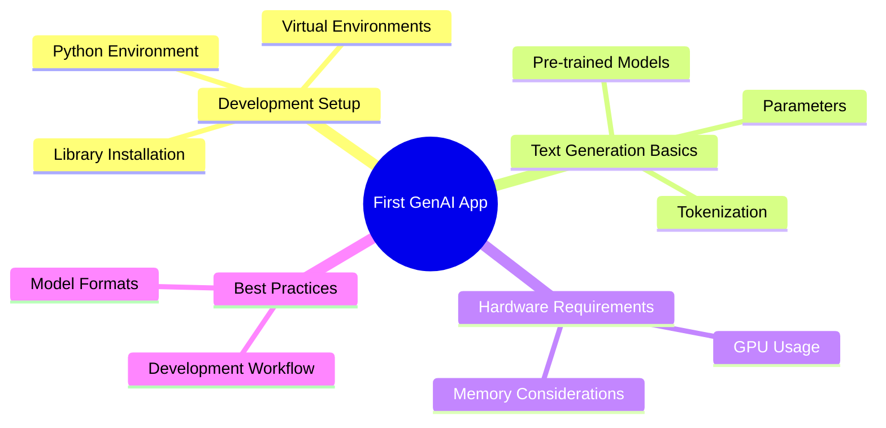

# 🚀 First GenAI Application - MCQ Assessment

<div align="center">

## 🎯 **Setting up Development Environment + Building Basic Text Generator**


</div>

---

## 📚 **Instructions**
> 🔍 **Read each question carefully**  
> ✅ **Choose the best answer from the 4 options**  
> 🎯 **Focus on practical implementation concepts**  
> 💻 **Consider real-world development scenarios**

---

## 🧠 **Assessment Questions**

### 🔹 **Question 1**
**Which Python library is most commonly used for building text generation applications?**

```
A) 📊 NumPy
B) 🤗 Transformers (Hugging Face)
C) 📈 Matplotlib
D) 🌐 Requests
```

> **💡 Correct Answer:** `B) 🤗 Transformers (Hugging Face)`

---

### 🔹 **Question 2**
**What is the recommended Python version for most modern GenAI applications?**

```
A) 🐍 Python 2.7
B) 🐍 Python 3.6
C) 🐍 Python 3.8 or higher
D) 🐍 Any Python version works
```

> **💡 Correct Answer:** `C) 🐍 Python 3.8 or higher`

---

### 🔹 **Question 3**
**Which command is used to install the Transformers library?**

```
A) 📦 pip install tensorflow
B) 📦 pip install transformers
C) 📦 pip install pytorch
D) 📦 pip install openai
```

> **💡 Correct Answer:** `B) 📦 pip install transformers`

---

### 🔹 **Question 4**
**What is the purpose of a virtual environment in Python development?**

```
A) 🚀 To make code run faster
B) 🔒 To isolate project dependencies
C) 💾 To save disk space
D) 🌐 To connect to the internet
```

> **💡 Correct Answer:** `B) 🔒 To isolate project dependencies`

---

### 🔹 **Question 5**
**Which of the following is a popular pre-trained model for text generation?**

```
A) 🤖 GPT-2
B) 📊 ResNet
C) 🖼️ YOLO
D) 📈 Linear Regression
```

> **💡 Correct Answer:** `A) 🤖 GPT-2`

---

### 🔹 **Question 6**
**What does "tokenization" mean in the context of text generation?**

```
A) 💰 Converting text to cryptocurrency
B) 🔤 Breaking text into smaller units (tokens)
C) 🔒 Encrypting text for security
D) 📊 Counting words in text
```

> **💡 Correct Answer:** `B) 🔤 Breaking text into smaller units (tokens)`

---

### 🔹 **Question 7**
**Which hardware component is most important for running large language models efficiently?**

```
A) 💾 Hard Drive
B) 🖥️ Monitor
C) 🎮 GPU (Graphics Processing Unit)
D) 🖱️ Mouse
```

> **💡 Correct Answer:** `C) 🎮 GPU (Graphics Processing Unit)`

---

### 🔹 **Question 8**
**What is the typical file format for saving a trained model in Hugging Face?**

```
A) 📄 .txt
B) 📊 .csv
C) 🤗 .bin or .safetensors
D) 🖼️ .jpg
```

> **💡 Correct Answer:** `C) 🤗 .bin or .safetensors`

---

### 🔹 **Question 9**
**Which parameter controls the randomness of text generation in most models?**

```
A) 🎯 Learning Rate
B) 🌡️ Temperature
C) 📏 Batch Size
D) 🔄 Epochs
```

> **💡 Correct Answer:** `B) 🌡️ Temperature`

---

### 🔹 **Question 10**
**What is the first step when building a basic text generator application?**

```
A) 🎨 Design the user interface
B) 📦 Install required libraries and dependencies
C) 🚀 Deploy to production
D) 📊 Collect user feedback
```

> **💡 Correct Answer:** `B) 📦 Install required libraries and dependencies`

---

## 📊 **Assessment Summary**

<div align="center">

| 📈 **Metric** | 📋 **Details** |
|---------------|----------------|
| 🎯 **Total Questions** | 10 |
| 📚 **Topic Coverage** | Development setup, basic text generation concepts |
| 🎓 **Difficulty Level** | Beginner to Intermediate |
| ⏱️ **Estimated Time** | 15-20 minutes |
| 🏆 **Passing Score** | 70% (7/10 correct) |

</div>

---

## 🎯 **Key Topics Covered**



---

## 🌟 **Good Luck with Your Assessment!**

<div align="center">

**💡 Remember:** Setting up the right development environment is crucial for successful GenAI application development!


</div>