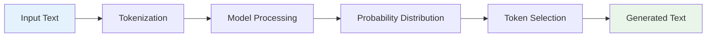

# 🚀 First GenAI Application
## PowerPoint Presentation: Setting up Development Environment + Building Basic Text Generator

---

## 📋 **Slide Index**
1. [Title Slide](#slide-1-title-slide)
2. [Learning Objectives](#slide-2-learning-objectives)
3. [What We'll Build](#slide-3-what-well-build)
4. [Prerequisites](#slide-4-prerequisites)
5. [Development Environment Setup](#slide-5-development-environment-setup)
6. [Python Virtual Environments](#slide-6-python-virtual-environments)
7. [Essential Libraries](#slide-7-essential-libraries)
8. [Hardware Requirements](#slide-8-hardware-requirements)
9. [Understanding Text Generation](#slide-9-understanding-text-generation)
10. [Pre-trained Models](#slide-10-pre-trained-models)
11. [Tokenization Concepts](#slide-11-tokenization-concepts)
12. [Building Your First Text Generator](#slide-12-building-your-first-text-generator)
13. [Code Implementation](#slide-13-code-implementation)
14. [Testing and Fine-tuning](#slide-14-testing-and-fine-tuning)
15. [Common Issues and Solutions](#slide-15-common-issues-and-solutions)
16. [Best Practices](#slide-16-best-practices)
17. [Next Steps](#slide-17-next-steps)
18. [Resources and Tools](#slide-18-resources-and-tools)
19. [Q&A](#slide-19-qa)

---

## **Slide 1: Title Slide**

<div align="center">

# 🚀 **First GenAI Application**
## Setting up Development Environment + Building Basic Text Generator

<br>

### 💻 **From Zero to Text Generation**
### 🛠️ **Hands-on Development Workshop**
### 🎯 **Practical Implementation Guide**

<br>

**Presented by:** [Your Name]  
**Date:** [Current Date]  
**Duration:** 60 minutes


</div>

---

## **Slide 2: Learning Objectives**

<div align="center">

# 🎯 **Learning Objectives**

</div>

By the end of this workshop, you will be able to:

### 🛠️ **Setup & Configuration**
- ✅ Set up a complete Python development environment
- ✅ Create and manage virtual environments
- ✅ Install and configure essential GenAI libraries

### 💻 **Development Skills**
- ✅ Understand text generation fundamentals
- ✅ Work with pre-trained language models
- ✅ Implement tokenization and text processing

### 🚀 **Build & Deploy**
- ✅ Create your first working text generator
- ✅ Test and fine-tune model parameters
- ✅ Apply best practices for GenAI development

### 🎯 **Practical Outcomes**
- ✅ A functional text generation application
- ✅ Understanding of the development workflow
- ✅ Foundation for advanced GenAI projects

---

## **Slide 3: What We'll Build**

<div align="center">

# 🎨 **What We'll Build Today**

</div>

### 🤖 **Basic Text Generator Application**
> A simple but powerful text generation tool using pre-trained models

### 🌟 **Key Features**
```
🔹 Interactive text generation
🔹 Customizable parameters (temperature, length)
🔹 Multiple model options
🔹 Clean, user-friendly interface
🔹 Error handling and validation
```

### 📱 **Demo Preview**
```python
# Input
prompt = "The future of artificial intelligence is"

# Output
"The future of artificial intelligence is incredibly promising, 
with advances in machine learning enabling new possibilities 
in healthcare, education, and scientific research..."
```

### 🎯 **Learning Value**
- 🧠 **Understand** core GenAI concepts
- 🛠️ **Practice** real development skills
- 🚀 **Build** portfolio-worthy project

---

## **Slide 4: Prerequisites**

<div align="center">

# 📋 **Prerequisites**

</div>

### 💻 **Technical Requirements**

#### 🐍 **Python Knowledge**
```
🔹 Basic Python syntax and concepts
🔹 Understanding of functions and classes
🔹 Familiarity with pip package manager
🔹 Command line/terminal usage
```

#### 🖥️ **System Requirements**
```
🔹 Python 3.8 or higher
🔹 4GB+ RAM (8GB+ recommended)
🔹 2GB+ free disk space
🔹 Internet connection for downloads
```

### 🧠 **Conceptual Knowledge**
- 📚 **Basic understanding** of machine learning
- 🤖 **Awareness** of what AI/ML can do
- 💡 **Curiosity** about text generation

### ✅ **Nice to Have**
- 🎮 **GPU** for faster processing
- 🐙 **Git** for version control
- 📝 **Code editor** (VS Code, PyCharm)

---

## **Slide 5: Development Environment Setup**

<div align="center">

# 🛠️ **Development Environment Setup**

</div>

### 🐍 **Step 1: Python Installation**
```bash
# Check if Python is installed
python --version
# or
python3 --version

# Should show Python 3.8+ 
```

### 📦 **Step 2: Package Manager**
```bash
# Verify pip installation
pip --version

# Upgrade pip to latest version
python -m pip install --upgrade pip
```

### 🔧 **Step 3: Development Tools**
```bash
# Install essential development tools
pip install jupyter notebook
pip install ipython
```

### 💻 **Recommended IDEs**
- 🆚 **VS Code** - Lightweight, great extensions
- 🐍 **PyCharm** - Full-featured Python IDE
- 📓 **Jupyter Notebook** - Interactive development
- ⚡ **Google Colab** - Cloud-based, free GPU

---

## **Slide 6: Python Virtual Environments**

<div align="center">

# 🔒 **Python Virtual Environments**

</div>

### 🤔 **Why Virtual Environments?**
```
🔹 Isolate project dependencies
🔹 Avoid version conflicts
🔹 Keep system Python clean
🔹 Easy project sharing
🔹 Reproducible environments
```

### 🛠️ **Creating Virtual Environment**
```bash
# Create virtual environment
python -m venv genai_env

# Activate (Windows)
genai_env\Scripts\activate

# Activate (Mac/Linux)
source genai_env/bin/activate

# Verify activation
which python
```

### 📦 **Managing Dependencies**
```bash
# Install packages in virtual environment
pip install package_name

# Save dependencies
pip freeze > requirements.txt

# Install from requirements
pip install -r requirements.txt
```

---

## **Slide 7: Essential Libraries**

<div align="center">

# 📚 **Essential Libraries**

</div>

### 🤗 **Core GenAI Libraries**
```bash
# Hugging Face Transformers (Main library)
pip install transformers

# PyTorch (Deep learning framework)
pip install torch torchvision torchaudio

# Alternative: TensorFlow
pip install tensorflow
```

### 🛠️ **Supporting Libraries**
```bash
# Data processing
pip install numpy pandas

# Text processing
pip install nltk spacy

# Web interface (optional)
pip install streamlit gradio

# Utilities
pip install tqdm requests
```

### 📋 **Complete Installation**
```bash
# One-line installation
pip install transformers torch numpy pandas nltk streamlit
```

### ⚡ **GPU Support (Optional)**
```bash
# For CUDA-enabled GPUs
pip install torch torchvision torchaudio --index-url https://download.pytorch.org/whl/cu118
```

---

## **Slide 8: Hardware Requirements**

<div align="center">

# 🖥️ **Hardware Requirements**

</div>

### 💾 **Memory Requirements**

| **Model Size** | **RAM Needed** | **GPU VRAM** | **Performance** |
|----------------|----------------|--------------|-----------------|
| 🤏 Small (124M) | 2GB | 1GB | ⚡ Fast |
| 📊 Medium (355M) | 4GB | 2GB | 🚀 Good |
| 📈 Large (774M) | 8GB | 4GB | 💪 Better |
| 🦣 XL (1.5B) | 16GB+ | 8GB+ | 🏆 Best |

### 🎮 **GPU vs CPU**
```
🎮 GPU Benefits:
  ✅ 10-100x faster inference
  ✅ Better for large models
  ✅ Parallel processing

💻 CPU Limitations:
  ⚠️ Slower processing
  ⚠️ Limited to smaller models
  ✅ More accessible/cheaper
```

### 🔧 **Optimization Tips**
- 🗜️ **Use smaller models** for learning
- ⚡ **Enable mixed precision** for GPU
- 💾 **Monitor memory usage**
- 🔄 **Batch processing** for efficiency

---

## **Slide 9: Understanding Text Generation**

<div align="center">

# 🧠 **Understanding Text Generation**

</div>

### 🤖 **How Text Generation Works**


### 🔤 **Key Concepts**

#### 📝 **Tokens**
```
🔹 Basic units of text (words, subwords, characters)
🔹 Models work with token IDs, not raw text
🔹 Vocabulary size determines model complexity
```

#### 🎲 **Probability Distribution**
```
🔹 Model predicts next token probabilities
🔹 Higher probability = more likely token
🔹 Sampling strategies affect creativity
```

#### 🌡️ **Temperature**
```
🔹 Controls randomness in generation
🔹 Low (0.1): More predictable, focused
🔹 High (1.0+): More creative, diverse
```

---

## **Slide 10: Pre-trained Models**

<div align="center">

# 🤖 **Pre-trained Models**

</div>

### 🏆 **Popular Text Generation Models**

| **Model** | **Size** | **Use Case** | **Difficulty** |
|-----------|----------|--------------|----------------|
| 🤖 **GPT-2** | 124M-1.5B | General text | 🟢 Beginner |
| 🦙 **LLaMA** | 7B-65B | Advanced text | 🟡 Intermediate |
| 🤗 **BERT** | 110M-340M | Understanding | 🟢 Beginner |
| ⚡ **DistilGPT-2** | 82M | Fast generation | 🟢 Beginner |

### 🎯 **Choosing the Right Model**
```
🔹 Start with GPT-2 small (124M)
🔹 Consider your hardware limitations
🔹 Balance quality vs speed
🔹 Check licensing requirements
```

### 📦 **Model Sources**
- 🤗 **Hugging Face Hub** - Largest collection
- 🧠 **OpenAI** - GPT models
- 🏢 **Company releases** - Meta, Google, etc.
- 🎓 **Research papers** - Latest innovations

### 💡 **Pro Tip**
> Always start with the smallest model that meets your needs, then scale up!

---

## **Slide 11: Tokenization Concepts**

<div align="center">

# 🔤 **Tokenization Concepts**

</div>

### 🧩 **What is Tokenization?**
> Converting text into numerical tokens that models can understand

### 📝 **Example Tokenization**
```python
# Input text
text = "Hello, world! How are you?"

# Tokens (simplified)
tokens = ["Hello", ",", "world", "!", "How", "are", "you", "?"]

# Token IDs
token_ids = [15496, 11, 995, 0, 1374, 389, 345, 30]
```

### 🔧 **Types of Tokenization**

#### 📖 **Word-level**
```
🔹 Split by spaces and punctuation
🔹 Large vocabulary size
🔹 Out-of-vocabulary problems
```

#### 🧩 **Subword-level (BPE)**
```
🔹 Break words into smaller pieces
🔹 Handles rare words better
🔹 Most modern models use this
```

#### 🔤 **Character-level**
```
🔹 Each character is a token
🔹 No vocabulary limits
🔹 Longer sequences
```

### 🛠️ **Practical Implementation**
```python
from transformers import GPT2Tokenizer

tokenizer = GPT2Tokenizer.from_pretrained('gpt2')
tokens = tokenizer.encode("Hello world!")
print(tokens)  # [15496, 995, 0]
```

---

## **Slide 12: Building Your First Text Generator**

<div align="center">

# 🏗️ **Building Your First Text Generator**

</div>

### 📋 **Project Structure**
```
genai_project/
├── 📁 src/
│   ├── 🐍 text_generator.py
│   └── 🐍 utils.py
├── 📁 models/
├── 📁 outputs/
├── 📄 requirements.txt
└── 📄 README.md
```

### 🎯 **Development Steps**

#### 1️⃣ **Import Libraries**
```python
from transformers import GPT2LMHeadModel, GPT2Tokenizer
import torch
```

#### 2️⃣ **Load Model and Tokenizer**
```python
model_name = "gpt2"
tokenizer = GPT2Tokenizer.from_pretrained(model_name)
model = GPT2LMHeadModel.from_pretrained(model_name)
```

#### 3️⃣ **Create Generation Function**
```python
def generate_text(prompt, max_length=100, temperature=0.7):
    # Implementation details in next slide
    pass
```

#### 4️⃣ **Test and Iterate**
```python
result = generate_text("The future of AI is")
print(result)
```

---

## **Slide 13: Code Implementation**

<div align="center">

# 💻 **Code Implementation**

</div>

### 🐍 **Complete Text Generator**
```python
from transformers import GPT2LMHeadModel, GPT2Tokenizer
import torch

class TextGenerator:
    def __init__(self, model_name="gpt2"):
        """Initialize the text generator"""
        self.tokenizer = GPT2Tokenizer.from_pretrained(model_name)
        self.model = GPT2LMHeadModel.from_pretrained(model_name)
        
        # Set padding token
        self.tokenizer.pad_token = self.tokenizer.eos_token
        
    def generate(self, prompt, max_length=100, temperature=0.7, 
                 num_return_sequences=1):
        """Generate text based on prompt"""
        
        # Encode the prompt
        inputs = self.tokenizer.encode(prompt, return_tensors='pt')
        
        # Generate text
        with torch.no_grad():
            outputs = self.model.generate(
                inputs,
                max_length=max_length,
                temperature=temperature,
                num_return_sequences=num_return_sequences,
                do_sample=True,
                pad_token_id=self.tokenizer.eos_token_id
            )
        
        # Decode and return results
        results = []
        for output in outputs:
            text = self.tokenizer.decode(output, skip_special_tokens=True)
            results.append(text)
            
        return results

# Usage example
generator = TextGenerator()
results = generator.generate("The future of artificial intelligence")
print(results[0])
```

---

## **Slide 14: Testing and Fine-tuning**

<div align="center">

# 🧪 **Testing and Fine-tuning**

</div>

### 🎛️ **Key Parameters to Adjust**

#### 🌡️ **Temperature**
```python
# Conservative (more predictable)
result = generator.generate(prompt, temperature=0.3)

# Balanced
result = generator.generate(prompt, temperature=0.7)

# Creative (more random)
result = generator.generate(prompt, temperature=1.2)
```

#### 📏 **Max Length**
```python
# Short responses
result = generator.generate(prompt, max_length=50)

# Medium responses
result = generator.generate(prompt, max_length=150)

# Long responses
result = generator.generate(prompt, max_length=300)
```

### 🧪 **Testing Strategy**
```python
# Test different prompts
test_prompts = [
    "Once upon a time",
    "The benefits of renewable energy",
    "In the year 2050",
    "The recipe for happiness"
]

for prompt in test_prompts:
    result = generator.generate(prompt, temperature=0.7)
    print(f"Prompt: {prompt}")
    print(f"Result: {result[0]}\n")
```

### 📊 **Quality Evaluation**
- ✅ **Coherence** - Does it make sense?
- ✅ **Relevance** - Stays on topic?
- ✅ **Creativity** - Interesting content?
- ✅ **Grammar** - Proper language use?

---

## **Slide 15: Common Issues and Solutions**

<div align="center">

# 🔧 **Common Issues and Solutions**

</div>

### ⚠️ **Memory Issues**
```python
# Problem: Out of memory errors
# Solution: Use smaller models or reduce batch size

# Use DistilGPT-2 (smaller)
generator = TextGenerator("distilgpt2")

# Clear cache
torch.cuda.empty_cache()  # For GPU
```

### 🔄 **Repetitive Output**
```python
# Problem: Model repeats same phrases
# Solutions:

# 1. Adjust temperature
result = generator.generate(prompt, temperature=0.8)

# 2. Use repetition penalty
outputs = model.generate(
    inputs,
    repetition_penalty=1.2,
    temperature=0.7
)
```

### 🐌 **Slow Generation**
```python
# Problem: Generation takes too long
# Solutions:

# 1. Reduce max_length
result = generator.generate(prompt, max_length=50)

# 2. Use GPU if available
device = torch.device("cuda" if torch.cuda.is_available() else "cpu")
model.to(device)
```

### 🚫 **Poor Quality Output**
```
🔹 Try different prompts
🔹 Adjust temperature settings
🔹 Use larger models if possible
🔹 Add context to prompts
```

---

## **Slide 16: Best Practices**

<div align="center">

# 🌟 **Best Practices**

</div>

### 📝 **Prompt Engineering**
```python
# Bad prompt
"Write something"

# Good prompt
"Write a professional email to a client explaining the delay in project delivery"

# Great prompt with context
"As a project manager, write a professional email to a client explaining 
that the software development project will be delayed by 2 weeks due to 
unexpected technical challenges. Maintain a positive tone and offer solutions."
```

### 🔒 **Error Handling**
```python
def safe_generate(self, prompt, **kwargs):
    try:
        if not prompt.strip():
            return ["Please provide a valid prompt."]
        
        results = self.generate(prompt, **kwargs)
        return results
        
    except Exception as e:
        return [f"Error generating text: {str(e)}"]
```

### 💾 **Resource Management**
```python
# Monitor memory usage
import psutil
print(f"Memory usage: {psutil.virtual_memory().percent}%")

# Clean up resources
del model
torch.cuda.empty_cache()
```

### 📊 **Logging and Monitoring**
```python
import logging

logging.basicConfig(level=logging.INFO)
logger = logging.getLogger(__name__)

def generate_with_logging(self, prompt, **kwargs):
    logger.info(f"Generating text for prompt: {prompt[:50]}...")
    start_time = time.time()
    
    results = self.generate(prompt, **kwargs)
    
    duration = time.time() - start_time
    logger.info(f"Generation completed in {duration:.2f} seconds")
    
    return results
```

---

## **Slide 17: Next Steps**

<div align="center">

# 🚀 **Next Steps**

</div>

### 🎯 **Immediate Improvements**
```
🔹 Add web interface with Streamlit/Gradio
🔹 Implement different model options
🔹 Add prompt templates
🔹 Create batch processing functionality
🔹 Add output formatting options
```

### 📈 **Advanced Features**
```
🔹 Fine-tune models on custom data
🔹 Implement conversation memory
🔹 Add multi-modal capabilities (text + images)
🔹 Create API endpoints
🔹 Deploy to cloud platforms
```

### 🎓 **Learning Path**
```
📚 Study transformer architecture
🧠 Learn about attention mechanisms
🔬 Explore different model architectures
📊 Understand evaluation metrics
⚖️ Learn about AI ethics and safety
```

### 🛠️ **Project Ideas**
- 📝 **Blog post generator**
- 💼 **Email assistant**
- 🎨 **Creative writing tool**
- 📚 **Study guide creator**
- 🤖 **Chatbot development**

---

## **Slide 18: Resources and Tools**

<div align="center">

# 📚 **Resources and Tools**

</div>

### 🌐 **Essential Websites**
```
🤗 Hugging Face Hub - https://huggingface.co/
📚 Transformers Documentation - https://huggingface.co/docs/transformers/
🐍 PyTorch Tutorials - https://pytorch.org/tutorials/
📖 Papers With Code - https://paperswithcode.com/
```

### 📖 **Learning Resources**
```
📚 "Natural Language Processing with Transformers" - O'Reilly
🎥 Hugging Face Course - Free online course
📺 YouTube: "Transformers Explained" series
🎓 Coursera: NLP Specialization
```

### 🛠️ **Development Tools**
```
💻 VS Code with Python extension
🐙 Git for version control
📓 Jupyter Notebooks for experimentation
🐳 Docker for containerization
☁️ Google Colab for free GPU access
```

### 🤝 **Community**
```
💬 Hugging Face Discord
📱 Reddit: r/MachineLearning
🐦 Twitter: #NLP #Transformers
📧 ML newsletters and blogs
```

### 📊 **Monitoring Tools**
```
📈 Weights & Biases (wandb)
📊 TensorBoard
🔍 MLflow
📱 Streamlit for demos
```

---

## **Slide 19: Q&A**

<div align="center">

# ❓ **Questions & Discussion**

<br>

## 🤔 **Common Questions**

### **Q: What if I don't have a GPU?**
**A:** Start with smaller models like DistilGPT-2 or use Google Colab for free GPU access. CPU-only development is totally fine for learning!

### **Q: How do I make the generated text more relevant?**
**A:** Focus on prompt engineering - be specific, provide context, and experiment with different phrasings.

### **Q: Can I use this for commercial projects?**
**A:** Check the model's license. Most Hugging Face models have clear licensing information. GPT-2 is open source and commercial-friendly.

### **Q: How do I improve generation quality?**
**A:** Try larger models, better prompts, adjust temperature, and consider fine-tuning on domain-specific data.

<br>

## 💬 **Open Discussion**
### Share your thoughts on:
- 🎯 What applications interest you most?
- 🤔 What challenges do you anticipate?
- 🚀 What would you like to build next?

<br>

## 📧 **Contact & Resources**
**Email:** [your.email@domain.com]  
**GitHub:** [Your GitHub with code examples]  
**Resources:** [Link to additional materials]

</div>

---

<div align="center">

# 🎉 **Congratulations!**

**You've built your first GenAI application! 🚀**


**Keep experimenting, keep learning! 💪**

</div>