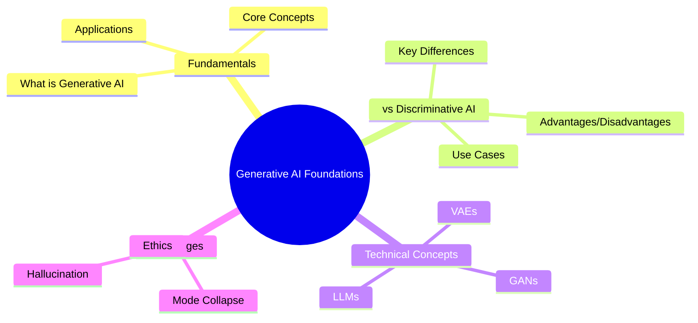

# 🤖 Generative AI Foundations - MCQ Assessment

<div align="center">

## 🎯 **What is Generative AI + Differences from Discriminative AI**


</div>

---

## 📚 **Instructions**
> 🔍 **Read each question carefully**  
> ✅ **Choose the best answer from the 4 options**  
> 🎯 **Check your answers against the provided solutions**

---

## 🧠 **Assessment Questions**

### 🔹 **Question 1**
**What is the primary purpose of Generative AI?**

```
A) 📊 To classify existing data into categories
B) ✨ To create new data that resembles training data
C) 💾 To compress data for storage
D) ✔️ To validate data accuracy
```

> **💡 Correct Answer:** `B) ✨ To create new data that resembles training data`

---

### 🔹 **Question 2**
**Which of the following is a key characteristic of Discriminative AI models?**

```
A) 🎨 They generate new content
B) 🎯 They learn the boundary between different classes
C) 🔄 They create synthetic data
D) 📈 They model the joint probability distribution
```

> **💡 Correct Answer:** `B) 🎯 They learn the boundary between different classes`

---

### 🔹 **Question 3**
**What does a Generative model learn?**

```
A) 📊 P(Y|X) - conditional probability of output given input
B) 🌐 P(X,Y) - joint probability distribution
C) 🎯 Only the decision boundary
D) 🔍 Feature extraction techniques
```

> **💡 Correct Answer:** `B) 🌐 P(X,Y) - joint probability distribution`

---

### 🔹 **Question 4**
**What does a Discriminative model learn?**

```
A) 🌐 P(X,Y) - joint probability distribution
B) 📊 P(X) - marginal probability of input
C) 🎯 P(Y|X) - conditional probability of output given input
D) 📈 P(Y) - marginal probability of output
```

> **💡 Correct Answer:** `C) 🎯 P(Y|X) - conditional probability of output given input`

---

### 🔹 **Question 5**
**Which of the following is an example of a Generative AI application?**

```
A) 📧 Email spam detection
B) 🖼️ Image classification
C) 🎨 Text-to-image generation
D) 😊 Sentiment analysis
```

> **💡 Correct Answer:** `C) 🎨 Text-to-image generation`

---

### 🔹 **Question 6**
**Which of the following is an example of a Discriminative AI application?**

```
A) 🎭 Creating deepfake videos
B) 🎵 Generating music compositions
C) 🏥 Medical image diagnosis
D) ✍️ Writing poetry
```

> **💡 Correct Answer:** `C) 🏥 Medical image diagnosis`

---

### 🔹 **Question 7**
**What is a Generative Adversarial Network (GAN)?**

```
A) 📊 A discriminative model for classification
B) ⚔️ A framework with two competing neural networks
C) 💾 A data compression algorithm
D) 🔍 A feature selection technique
```

> **💡 Correct Answer:** `B) ⚔️ A framework with two competing neural networks`

---

### 🔹 **Question 8**
**In a GAN, what is the role of the Generator?**

```
A) 🔍 To classify real vs fake data
B) 🎨 To create synthetic data that fools the discriminator
C) 💾 To compress input data
D) ✅ To validate model accuracy
```

> **💡 Correct Answer:** `B) 🎨 To create synthetic data that fools the discriminator`

---

### 🔹 **Question 9**
**In a GAN, what is the role of the Discriminator?**

```
A) 🎨 To generate new data samples
B) 🕵️ To distinguish between real and generated data
C) ⚙️ To optimize the generator's parameters
D) 🔄 To preprocess input data
```

> **💡 Correct Answer:** `B) 🕵️ To distinguish between real and generated data`

---

### 🔹 **Question 10**
**Which type of model is better for data generation tasks?**

```
A) 📊 Discriminative models
B) ✨ Generative models
C) ⚖️ Both are equally effective
D) ❌ Neither can generate data
```

> **💡 Correct Answer:** `B) ✨ Generative models`

---

### 🔹 **Question 11**
**Which type of model typically requires less training data?**

```
A) ✨ Generative models
B) 📊 Discriminative models
C) ⚖️ Both require the same amount
D) 🤔 It depends on the specific algorithm
```

> **💡 Correct Answer:** `B) 📊 Discriminative models`

---

### 🔹 **Question 12**
**What is a Variational Autoencoder (VAE)?**

```
A) 📊 A discriminative model for classification
B) 🧠 A generative model that learns latent representations
C) 🔄 A data preprocessing technique
D) 📏 A model evaluation metric
```

> **💡 Correct Answer:** `B) 🧠 A generative model that learns latent representations`

---

### 🔹 **Question 13**
**Which of the following is a characteristic of Large Language Models (LLMs)?**

```
A) 📊 They only perform classification tasks
B) 💬 They can generate human-like text
C) ❌ They cannot understand context
D) 🔢 They only work with numerical data
```

> **💡 Correct Answer:** `B) 💬 They can generate human-like text`

---

### 🔹 **Question 14**
**What is the main advantage of Discriminative models over Generative models?**

```
A) 🎨 Better at creating new content
B) ⚡ More computationally efficient for classification
C) 📈 Can model complex data distributions
D) 🎓 Better at unsupervised learning
```

> **💡 Correct Answer:** `B) ⚡ More computationally efficient for classification`

---

### 🔹 **Question 15**
**What is the main advantage of Generative models over Discriminative models?**

```
A) ⚡ Faster training time
B) 🎯 Better classification accuracy
C) ✨ Can create new data and handle missing data
D) 💾 Require less memory
```

> **💡 Correct Answer:** `C) ✨ Can create new data and handle missing data`

---

### 🔹 **Question 16**
**Which of the following is NOT a generative model?**

```
A) 📊 Gaussian Mixture Model (GMM)
B) 🔄 Hidden Markov Model (HMM)
C) 🎯 Support Vector Machine (SVM)
D) 🧠 Variational Autoencoder (VAE)
```

> **💡 Correct Answer:** `C) 🎯 Support Vector Machine (SVM)`

---

### 🔹 **Question 17**
**Which of the following is NOT a discriminative model?**

```
A) 📈 Logistic Regression
B) 🌳 Random Forest
C) 🎲 Naive Bayes
D) 🧠 Neural Networks (for classification)
```

> **💡 Correct Answer:** `C) 🎲 Naive Bayes`

---

### 🔹 **Question 18**
**What does "mode collapse" refer to in the context of GANs?**

```
A) 💪 The discriminator becomes too powerful
B) 📉 The generator produces limited variety in outputs
C) ❌ The model fails to converge
D) 💥 The training data becomes corrupted
```

> **💡 Correct Answer:** `B) 📉 The generator produces limited variety in outputs`

---

### 🔹 **Question 19**
**Which evaluation metric is commonly used for generative models?**

```
A) 🎯 Accuracy
B) ⚖️ Precision and Recall
C) 🏆 Inception Score (IS)
D) 📊 F1-Score
```

> **💡 Correct Answer:** `C) 🏆 Inception Score (IS)`

---

### 🔹 **Question 20**
**What is the key difference in the training objective between generative and discriminative models?**

```
A) ✨ Generative models minimize classification error
B) 📊 Discriminative models maximize likelihood
C) 🎯 Generative models learn data distribution, discriminative models learn decision boundaries
D) ⚖️ There is no difference in training objectives
```

> **💡 Correct Answer:** `C) 🎯 Generative models learn data distribution, discriminative models learn decision boundaries`

---

### 🔹 **Question 21**
**Which of the following best describes "hallucination" in generative AI?**

```
A) 🎨 The model's ability to create realistic images
B) 🚫 When the model generates false or nonsensical information
C) 🔄 The model's training process
D) 🏗️ A type of neural network architecture
```

> **💡 Correct Answer:** `B) 🚫 When the model generates false or nonsensical information`

---

### 🔹 **Question 22**
**What is a key challenge in training generative models?**

```
A) 💻 Limited computational resources
B) 📏 Evaluating the quality of generated content
C) 📊 Lack of training data
D) 🏗️ Simple model architectures
```

> **💡 Correct Answer:** `B) 📏 Evaluating the quality of generated content`

---

### 🔹 **Question 23**
**Which type of learning is most associated with generative models?**

```
A) 👨‍🏫 Supervised learning only
B) 🔍 Unsupervised learning
C) 🎮 Reinforcement learning only
D) 📚 Semi-supervised learning only
```

> **💡 Correct Answer:** `B) 🔍 Unsupervised learning`

---

### 🔹 **Question 24**
**What is the primary goal of a discriminative model in a binary classification task?**

```
A) ✨ Generate new examples of each class
B) 🎯 Find the optimal decision boundary between classes
C) 📈 Model the probability distribution of each class
D) 🔄 Create synthetic training data
```

> **💡 Correct Answer:** `B) 🎯 Find the optimal decision boundary between classes`

---

### 🔹 **Question 25**
**Which of the following is a common application of generative AI in creative industries?**

```
A) 🚨 Fraud detection
B) 👥 Customer segmentation
C) 🎨 Art and music generation
D) 🔒 Network security
```

> **💡 Correct Answer:** `C) 🎨 Art and music generation`

---

### 🔹 **Question 26**
**What is "prompt engineering" in the context of generative AI?**

```
A) 🔧 Building the hardware for AI systems
B) 💡 Designing effective input instructions for AI models
C) 📊 Training discriminative models
D) ⚙️ Optimizing model architecture
```

> **💡 Correct Answer:** `B) 💡 Designing effective input instructions for AI models`

---

### 🔹 **Question 27**
**Which of the following statements about computational complexity is generally true?**

```
A) ✨ Generative models are always faster than discriminative models
B) ⚡ Discriminative models are typically more computationally efficient for classification
C) ⚖️ Both types have identical computational requirements
D) 📊 Complexity depends only on dataset size
```

> **💡 Correct Answer:** `B) ⚡ Discriminative models are typically more computationally efficient for classification`

---

### 🔹 **Question 28**
**What is a "latent space" in generative models?**

```
A) 📥 The input data space
B) 🗜️ A lower-dimensional representation of data
C) 📤 The output prediction space
D) 📏 The error measurement space
```

> **💡 Correct Answer:** `B) 🗜️ A lower-dimensional representation of data`

---

### 🔹 **Question 29**
**Which approach is more suitable for few-shot learning scenarios?**

```
A) 📊 Discriminative models only
B) ✨ Generative models only
C) 🤝 Both can be effective depending on implementation
D) ❌ Neither approach works for few-shot learning
```

> **💡 Correct Answer:** `C) 🤝 Both can be effective depending on implementation`

---

### 🔹 **Question 30**
**What is the main ethical concern associated with generative AI?**

```
A) 💰 High computational costs
B) ⚠️ Potential for creating misleading or harmful content
C) 🐌 Slow processing speed
D) 📉 Limited application domains
```

> **💡 Correct Answer:** `B) ⚠️ Potential for creating misleading or harmful content`

---

## 📊 **Assessment Summary**

<div align="center">

| 📈 **Metric** | 📋 **Details** |
|---------------|----------------|
| 🎯 **Total Questions** | 30 |
| 📚 **Topic Coverage** | Generative AI fundamentals, differences from discriminative AI |
| 🎓 **Difficulty Level** | Foundation to Intermediate |
| ⏱️ **Estimated Time** | 45-60 minutes |
| 🏆 **Passing Score** | 70% (21/30 correct) |

</div>

---

## 🎯 **Key Topics Covered**



---

## 🌟 **Good Luck with Your Assessment!**

<div align="center">

**💡 Remember:** Understanding the fundamental differences between generative and discriminative AI is crucial for building a strong foundation in modern AI systems!


</div>