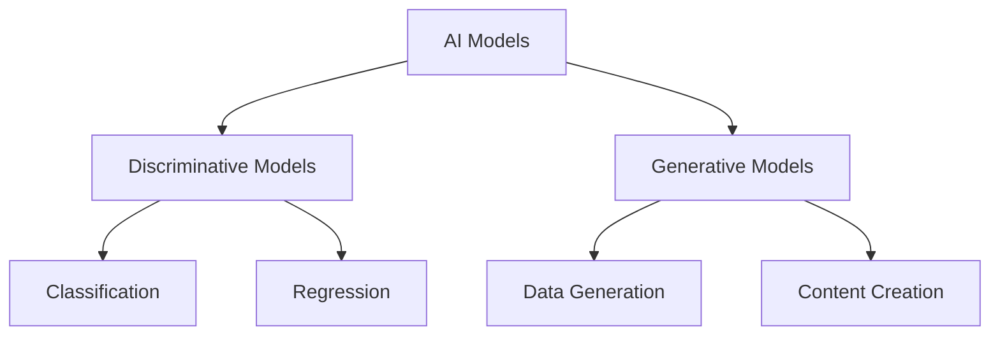
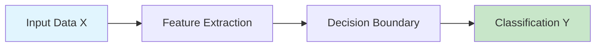
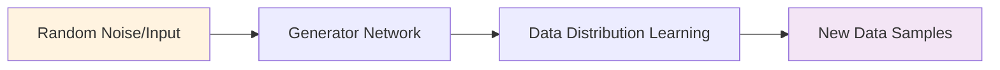
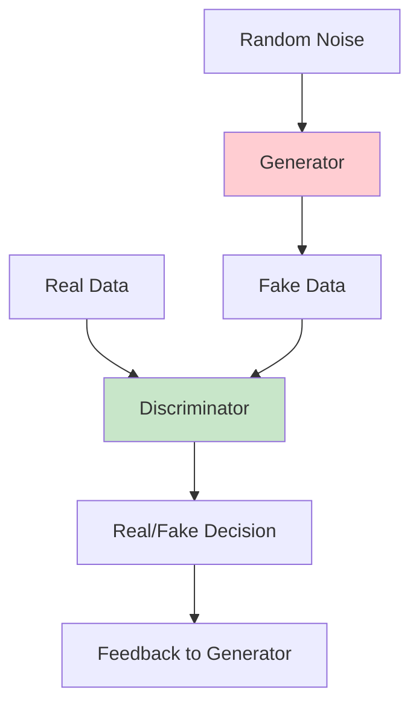
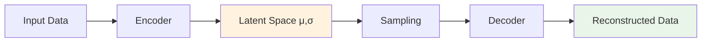
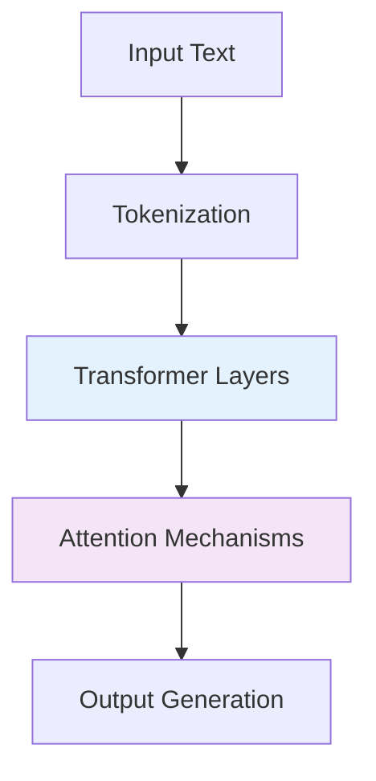

# 🤖 Generative AI Foundations
## PowerPoint Presentation: What is Generative AI + Differences from Discriminative AI

---

## 📋 **Slide Index**
1. [Title Slide](#slide-1-title-slide)
2. [Learning Objectives](#slide-2-learning-objectives)
3. [What is Artificial Intelligence?](#slide-3-what-is-artificial-intelligence)
4. [Types of AI Models](#slide-4-types-of-ai-models)
5. [What is Discriminative AI?](#slide-5-what-is-discriminative-ai)
6. [What is Generative AI?](#slide-6-what-is-generative-ai)
7. [Key Mathematical Differences](#slide-7-key-mathematical-differences)
8. [Discriminative AI Examples](#slide-8-discriminative-ai-examples)
9. [Generative AI Examples](#slide-9-generative-ai-examples)
10. [Generative Adversarial Networks (GANs)](#slide-10-generative-adversarial-networks-gans)
11. [Variational Autoencoders (VAEs)](#slide-11-variational-autoencoders-vaes)
12. [Large Language Models (LLMs)](#slide-12-large-language-models-llms)
13. [Comparison Table](#slide-13-comparison-table)
14. [Applications in Industry](#slide-14-applications-in-industry)
15. [Challenges and Limitations](#slide-15-challenges-and-limitations)
16. [Future Trends](#slide-16-future-trends)
17. [Ethical Considerations](#slide-17-ethical-considerations)
18. [Summary](#slide-18-summary)
19. [Q&A](#slide-19-qa)

---

## **Slide 1: Title Slide**

<div align="center">

# 🤖 **Generative AI Foundations**
## What is Generative AI + Differences from Discriminative AI

<br>

### 🎯 **Understanding the Core Concepts**
### 🔬 **Exploring Key Differences**
### 🚀 **Real-World Applications**

<br>

**Presented by:** [Your Name]  
**Date:** [Current Date]  
**Duration:** 45 minutes


</div>

---

## **Slide 2: Learning Objectives**

<div align="center">

# 🎯 **Learning Objectives**

</div>

By the end of this presentation, you will be able to:

### 🔍 **Understand**
- ✅ Define Generative AI and Discriminative AI
- ✅ Explain the fundamental differences between both approaches
- ✅ Identify key mathematical concepts (P(X,Y) vs P(Y|X))

### 🛠️ **Apply**
- ✅ Recognize real-world applications of each type
- ✅ Choose appropriate model types for different tasks
- ✅ Understand popular architectures (GANs, VAEs, LLMs)

### 🧠 **Analyze**
- ✅ Compare advantages and disadvantages
- ✅ Evaluate ethical implications
- ✅ Assess future trends and challenges

---

## **Slide 3: What is Artificial Intelligence?**

<div align="center">

# 🧠 **What is Artificial Intelligence?**

</div>

### 🤖 **Definition**
> Artificial Intelligence is the simulation of human intelligence in machines that are programmed to think and learn like humans.

### 🌟 **Key Characteristics**
```
🔹 Learning from data
🔹 Pattern recognition
🔹 Decision making
🔹 Problem solving
🔹 Adaptation to new situations
```

### 📊 **AI Model Categories**


---

## **Slide 4: Types of AI Models**

<div align="center">

# 🔄 **Types of AI Models**

</div>

### 🎯 **Two Main Categories**

| 📊 **Discriminative Models** | ✨ **Generative Models** |
|------------------------------|---------------------------|
| 🎯 **Focus:** Decision boundaries | 🎨 **Focus:** Data distribution |
| 📈 **Goal:** Classify or predict | 🔄 **Goal:** Generate new data |
| ⚡ **Efficiency:** Fast inference | 🧠 **Capability:** Creative tasks |
| 📊 **Learning:** P(Y\|X) | 🌐 **Learning:** P(X,Y) |

### 🔍 **Key Question**
> **"What type of problem are you trying to solve?"**
> - 🎯 **Classification/Prediction** → Discriminative
> - 🎨 **Content Creation** → Generative

---

## **Slide 5: What is Discriminative AI?**

<div align="center">

# 📊 **What is Discriminative AI?**

</div>

### 🎯 **Definition**
> Discriminative models learn the **decision boundary** between different classes or categories in data.

### 🧮 **Mathematical Foundation**
```
🔹 Learns: P(Y|X) - Conditional probability
🔹 Given input X, what is the probability of output Y?
🔹 Focus: Mapping inputs to outputs efficiently
```

### 🏗️ **Architecture Approach**


### ✅ **Key Strengths**
- ⚡ **Fast training and inference**
- 🎯 **High accuracy for classification**
- 💾 **Memory efficient**
- 📊 **Less training data required**

---

## **Slide 6: What is Generative AI?**

<div align="center">

# ✨ **What is Generative AI?**

</div>

### 🎨 **Definition**
> Generative models learn the **underlying data distribution** to create new, similar data samples.

### 🧮 **Mathematical Foundation**
```
🔹 Learns: P(X,Y) - Joint probability distribution
🔹 Models how data is generated
🔹 Focus: Understanding data structure and patterns
```

### 🏗️ **Architecture Approach**


### ✅ **Key Strengths**
- 🎨 **Creates new content**
- 🔄 **Handles missing data**
- 🧠 **Learns complex patterns**
- 🌟 **Enables creative applications**

---

## **Slide 7: Key Mathematical Differences**

<div align="center">

# 🧮 **Key Mathematical Differences**

</div>

### 📊 **Probability Distributions**

| **Aspect** | **Discriminative** | **Generative** |
|------------|-------------------|----------------|
| **Learns** | P(Y\|X) | P(X,Y) |
| **Meaning** | Probability of Y given X | Joint probability of X and Y |
| **Focus** | Decision boundaries | Data distribution |
| **Question** | "What class is this?" | "How is data generated?" |

### 🔍 **Visual Representation**

```
📊 Discriminative: X → [Black Box] → Y
   Input → Decision Function → Output

✨ Generative: [Distribution Model] → X,Y
   Data Model → Generate New Samples
```

### 🎯 **Practical Implication**
- **Discriminative:** Optimized for specific tasks
- **Generative:** Flexible for multiple applications

---

## **Slide 8: Discriminative AI Examples**

<div align="center">

# 📊 **Discriminative AI Examples**

</div>

### 🏥 **Healthcare**
```
🔹 Medical image diagnosis (X-rays, MRIs)
🔹 Disease prediction from symptoms
🔹 Drug interaction classification
```

### 💼 **Business & Finance**
```
🔹 Email spam detection
🔹 Credit score assessment
🔹 Fraud detection systems
🔹 Customer churn prediction
```

### 🤖 **Technology**
```
🔹 Image recognition (face detection)
🔹 Speech recognition
🔹 Sentiment analysis
🔹 Recommendation systems
```

### 🎯 **Common Algorithms**
- 🧠 **Neural Networks** (for classification)
- 🌳 **Random Forest**
- 📈 **Logistic Regression**
- 🎯 **Support Vector Machines (SVM)**

---

## **Slide 9: Generative AI Examples**

<div align="center">

# ✨ **Generative AI Examples**

</div>

### 🎨 **Creative Industries**
```
🔹 AI art generation (DALL-E, Midjourney)
🔹 Music composition
🔹 Creative writing and storytelling
🔹 Video game content generation
```

### 💬 **Language & Communication**
```
🔹 ChatGPT and language models
🔹 Code generation (GitHub Copilot)
🔹 Translation services
🔹 Content creation for marketing
```

### 🎭 **Media & Entertainment**
```
🔹 Deepfake technology
🔹 Voice synthesis
🔹 Movie script generation
🔹 Personalized content creation
```

### 🛠️ **Popular Technologies**
- 🤖 **Large Language Models (LLMs)**
- ⚔️ **Generative Adversarial Networks (GANs)**
- 🧠 **Variational Autoencoders (VAEs)**
- 🔄 **Diffusion Models**

---

## **Slide 10: Generative Adversarial Networks (GANs)**

<div align="center">

# ⚔️ **Generative Adversarial Networks (GANs)**

</div>

### 🎭 **The Concept**
> Two neural networks competing against each other in a game-theoretic framework

### 🏗️ **Architecture**


### 🎯 **Key Components**
- 🎨 **Generator:** Creates fake data to fool discriminator
- 🕵️ **Discriminator:** Distinguishes real from fake data
- ⚔️ **Adversarial Training:** Both networks improve together

### 🌟 **Applications**
- 🖼️ **Image generation**
- 🎭 **Face synthesis**
- 🎨 **Style transfer**
- 📸 **Super-resolution**

---

## **Slide 11: Variational Autoencoders (VAEs)**

<div align="center">

# 🧠 **Variational Autoencoders (VAEs)**

</div>

### 🔄 **The Concept**
> Neural networks that learn efficient data representations in a latent space

### 🏗️ **Architecture**


### 🎯 **Key Features**
- 🗜️ **Compression:** Learns compact representations
- 🎲 **Probabilistic:** Uses probability distributions
- 🔄 **Reconstruction:** Can recreate original data
- ✨ **Generation:** Can create new similar data

### 🌟 **Applications**
- 🖼️ **Image compression**
- 🎨 **Data augmentation**
- 🔍 **Anomaly detection**
- 🧬 **Drug discovery**

---

## **Slide 12: Large Language Models (LLMs)**

<div align="center">

# 💬 **Large Language Models (LLMs)**

</div>

### 🤖 **The Concept**
> Massive neural networks trained on vast amounts of text data to understand and generate human-like language

### 📊 **Scale & Capability**
```
🔹 Parameters: Billions to Trillions
🔹 Training Data: Internet-scale text
🔹 Capabilities: Text generation, reasoning, coding
🔹 Examples: GPT-4, Claude, LLaMA, PaLM
```

### 🏗️ **Architecture Foundation**


### 🌟 **Key Applications**
- 💬 **Conversational AI**
- 📝 **Content creation**
- 💻 **Code generation**
- 🌐 **Language translation**
- 📚 **Educational assistance**

---

## **Slide 13: Comparison Table**

<div align="center">

# ⚖️ **Comprehensive Comparison**

</div>

| **Aspect** | **Discriminative AI** | **Generative AI** |
|------------|----------------------|-------------------|
| **🎯 Primary Goal** | Classification/Prediction | Content Generation |
| **🧮 Mathematical Focus** | P(Y\|X) | P(X,Y) |
| **⚡ Training Speed** | Faster | Slower |
| **💾 Data Requirements** | Less data needed | More data needed |
| **🎨 Creativity** | Limited | High |
| **🔍 Interpretability** | Higher | Lower |
| **💰 Computational Cost** | Lower | Higher |
| **🎯 Task Specificity** | Task-specific | Multi-purpose |
| **📊 Evaluation** | Clear metrics | Subjective quality |
| **🚀 Innovation Potential** | Incremental | Revolutionary |

### 🤔 **When to Choose Which?**
- **📊 Choose Discriminative:** Classification, prediction, analysis tasks
- **✨ Choose Generative:** Content creation, data augmentation, creative tasks

---

## **Slide 14: Applications in Industry**

<div align="center">

# 🏭 **Applications in Industry**

</div>

### 🏥 **Healthcare**
| **Discriminative** | **Generative** |
|-------------------|----------------|
| 🔍 Disease diagnosis | 🧬 Drug discovery |
| 📊 Risk assessment | 🖼️ Medical image synthesis |
| 📈 Treatment prediction | 📋 Synthetic patient data |

### 💼 **Finance**
| **Discriminative** | **Generative** |
|-------------------|----------------|
| 🚨 Fraud detection | 📊 Synthetic financial data |
| 📈 Credit scoring | 📋 Report generation |
| 📊 Risk analysis | 🤖 Trading strategies |

### 🎮 **Entertainment**
| **Discriminative** | **Generative** |
|-------------------|----------------|
| 🎯 Content recommendation | 🎨 Game asset creation |
| 😊 Sentiment analysis | 🎵 Music generation |
| 👤 User behavior analysis | 📚 Story creation |

### 🚗 **Automotive**
| **Discriminative** | **Generative** |
|-------------------|----------------|
| 🚦 Object detection | 🌍 Simulation environments |
| 🛣️ Path planning | 🚗 Vehicle design |
| ⚠️ Safety systems | 📊 Test scenario generation |

---

## **Slide 15: Challenges and Limitations**

<div align="center">

# ⚠️ **Challenges and Limitations**

</div>

### 📊 **Discriminative AI Challenges**
```
🔹 Limited to specific tasks
🔹 Requires labeled training data
🔹 Poor generalization to new domains
🔹 Cannot handle missing data well
🔹 Vulnerable to adversarial attacks
```

### ✨ **Generative AI Challenges**
```
🔹 Computationally expensive
🔹 Difficult to evaluate quality
🔹 Mode collapse in GANs
🔹 Hallucination in language models
🔹 Potential for misuse (deepfakes)
```

### 🛡️ **Common Solutions**
- 🔄 **Transfer learning**
- 📊 **Data augmentation**
- 🧠 **Ensemble methods**
- ⚖️ **Regularization techniques**
- 🔍 **Robust evaluation metrics**

### 🎯 **Best Practices**
- ✅ **Choose appropriate model type**
- 📊 **Ensure data quality**
- 🔍 **Regular model validation**
- ⚖️ **Consider ethical implications**

---

## **Slide 16: Future Trends**

<div align="center">

# 🚀 **Future Trends**

</div>

### 🌟 **Emerging Developments**

#### 🤖 **Multimodal AI**
```
🔹 Text + Image + Audio integration
🔹 Cross-modal understanding
🔹 Unified model architectures
```

#### 🧠 **Foundation Models**
```
🔹 Large-scale pre-trained models
🔹 Fine-tuning for specific tasks
🔹 Transfer learning capabilities
```

#### ⚡ **Efficiency Improvements**
```
🔹 Model compression techniques
🔹 Edge AI deployment
🔹 Green AI initiatives
```

### 🔮 **Predictions for 2024-2030**
- 🎯 **Hybrid models** combining discriminative and generative approaches
- 🌐 **Democratization** of AI tools
- 🛡️ **Better safety** and alignment techniques
- 🔄 **Real-time generation** capabilities
- 🤝 **Human-AI collaboration** tools

---

## **Slide 17: Ethical Considerations**

<div align="center">

# ⚖️ **Ethical Considerations**

</div>

### 🚨 **Key Concerns**

#### 🎭 **Generative AI Risks**
```
⚠️ Deepfakes and misinformation
⚠️ Copyright and intellectual property
⚠️ Job displacement in creative industries
⚠️ Bias amplification in generated content
⚠️ Privacy concerns with training data
```

#### 📊 **Discriminative AI Risks**
```
⚠️ Algorithmic bias in decision-making
⚠️ Privacy invasion through profiling
⚠️ Lack of transparency in decisions
⚠️ Unfair treatment of minorities
⚠️ Over-reliance on automated systems
```

### 🛡️ **Mitigation Strategies**
- ✅ **Responsible AI development**
- 📋 **Ethical guidelines and frameworks**
- 🔍 **Regular bias auditing**
- 🤝 **Stakeholder involvement**
- 📚 **AI literacy education**
- ⚖️ **Regulatory compliance**

---

## **Slide 18: Summary**

<div align="center">

# 📋 **Key Takeaways**

</div>

### 🎯 **Core Differences**
```
📊 Discriminative AI: Learns P(Y|X) - Decision boundaries
✨ Generative AI: Learns P(X,Y) - Data distributions
```

### 🔍 **When to Use Each**
- **📊 Discriminative:** Classification, prediction, analysis
- **✨ Generative:** Content creation, data synthesis, creativity

### 🌟 **Popular Technologies**
- **Discriminative:** Neural Networks, SVM, Random Forest
- **Generative:** GANs, VAEs, LLMs, Diffusion Models

### 🚀 **Future Outlook**
```
🔹 Hybrid approaches combining both types
🔹 More efficient and accessible models
🔹 Better safety and ethical frameworks
🔹 Widespread industry adoption
```

### 💡 **Remember**
> The choice between discriminative and generative AI depends on your specific use case, available resources, and desired outcomes.

---

## **Slide 19: Q&A**

<div align="center">

# ❓ **Questions & Discussion**

<br>

## 🤔 **Common Questions**

### **Q: Can a model be both discriminative and generative?**
**A:** Yes! Some models like conditional GANs can both generate data and perform classification tasks.

### **Q: Which type is better for beginners?**
**A:** Discriminative models are often easier to start with due to clearer evaluation metrics and faster training.

### **Q: What's the future of AI - discriminative or generative?**
**A:** Both will coexist and complement each other. Hybrid approaches are becoming increasingly popular.

<br>

## 💬 **Open Discussion**
### Share your thoughts on:
- 🎯 Real-world applications you've encountered
- 🤔 Challenges in your domain
- 🚀 Future possibilities you're excited about

<br>

## 📧 **Contact Information**
**Email:** [your.email@domain.com]  
**LinkedIn:** [Your LinkedIn Profile]  
**Resources:** [Additional Learning Materials]

</div>

---

<div align="center">

# 🙏 **Thank You!**


**Keep Learning, Keep Growing! 🚀**

</div>