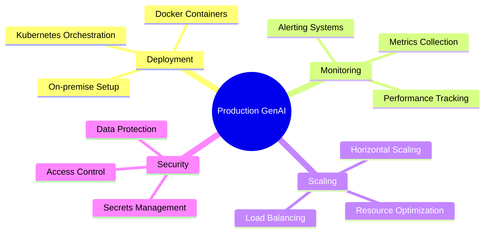

# 🏭 Production GenAI System - MCQ Assessment

<div align="center">

## 🎯 **Deploying GenAI Onprem + Setting up Monitoring + Scaling Configuration**


</div>

---

## 📚 **Instructions**
> 🔍 **Read each question carefully**  
> ✅ **Choose the best answer from the 4 options**  
> 🎯 **Focus on production deployment concepts**  
> 🏭 **Consider enterprise-level requirements**

---

## 🧠 **Assessment Questions**

### 🔹 **Question 1**
**Which containerization technology is most commonly used for deploying GenAI applications in production?**

```
A) 📦 Docker
B) 🖥️ Virtual Machines
C) 🔧 Bare Metal
D) ☁️ Serverless Functions
```

> **💡 Correct Answer:** `A) 📦 Docker`

---

### 🔹 **Question 2**
**What is the primary benefit of using Kubernetes for GenAI deployment?**

```
A) 💰 Reduces licensing costs
B) ⚖️ Automatic scaling and orchestration
C) 🔒 Enhanced security only
D) 📊 Better model accuracy
```

> **💡 Correct Answer:** `B) ⚖️ Automatic scaling and orchestration`

---

### 🔹 **Question 3**
**Which monitoring metric is most critical for GenAI applications in production?**

```
A) 💾 Disk space usage
B) 🌐 Network bandwidth
C) ⏱️ Model inference latency
D) 🖥️ CPU temperature
```

> **💡 Correct Answer:** `C) ⏱️ Model inference latency`

---

### 🔹 **Question 4**
**What is the recommended approach for handling model versioning in production?**

```
A) 🔄 Replace models directly in production
B) 📂 Keep only the latest model version
C) 🔀 Blue-green deployment strategy
D) 🎲 Random model selection
```

> **💡 Correct Answer:** `C) 🔀 Blue-green deployment strategy`

---

### 🔹 **Question 5**
**Which tool is commonly used for monitoring GenAI applications?**

```
A) 📊 Prometheus + Grafana
B) 📝 Microsoft Word
C) 🎨 Photoshop
D) 🎵 Spotify
```

> **💡 Correct Answer:** `A) 📊 Prometheus + Grafana`

---

### 🔹 **Question 6**
**What is the purpose of a load balancer in GenAI deployment?**

```
A) 🔒 Encrypt model weights
B) ⚖️ Distribute requests across multiple instances
C) 💾 Store model checkpoints
D) 🎨 Generate better outputs
```

> **💡 Correct Answer:** `B) ⚖️ Distribute requests across multiple instances`

---

### 🔹 **Question 7**
**Which scaling strategy is most appropriate for handling variable GenAI workloads?**

```
A) 📊 Manual scaling only
B) 🔄 Horizontal Pod Autoscaling (HPA)
C) 🔒 No scaling needed
D) 📈 Vertical scaling only
```

> **💡 Correct Answer:** `B) 🔄 Horizontal Pod Autoscaling (HPA)`

---

### 🔹 **Question 8**
**What is the recommended practice for storing sensitive model configurations?**

```
A) 📄 Plain text files
B) 🔐 Kubernetes Secrets
C) 📧 Email attachments
D) 🌐 Public repositories
```

> **💡 Correct Answer:** `B) 🔐 Kubernetes Secrets`

---

### 🔹 **Question 9**
**Which component is essential for logging in a production GenAI system?**

```
A) 🎮 Gaming console
B) 📊 ELK Stack (Elasticsearch, Logstash, Kibana)
C) 🎵 Audio system
D) 🖼️ Image viewer
```

> **💡 Correct Answer:** `B) 📊 ELK Stack (Elasticsearch, Logstash, Kibana)`

---

### 🔹 **Question 10**
**What is the primary consideration when choosing GPU resources for production GenAI deployment?**

```
A) 🎨 GPU color
B) 💰 Cost vs Performance optimization
C) 🔊 GPU noise level
D) 📏 Physical size only
```

> **💡 Correct Answer:** `B) 💰 Cost vs Performance optimization`

---

## 📊 **Assessment Summary**

<div align="center">

| 📈 **Metric** | 📋 **Details** |
|---------------|----------------|
| 🎯 **Total Questions** | 10 |
| 📚 **Topic Coverage** | Production deployment, monitoring, scaling |
| 🎓 **Difficulty Level** | Intermediate to Advanced |
| ⏱️ **Estimated Time** | 20-25 minutes |
| 🏆 **Passing Score** | 70% (7/10 correct) |

</div>

---

## 🎯 **Key Topics Covered**



---

## 🌟 **Good Luck with Your Assessment!**

<div align="center">

**💡 Remember:** Production GenAI systems require careful planning for deployment, monitoring, and scaling to ensure reliable performance!


</div>