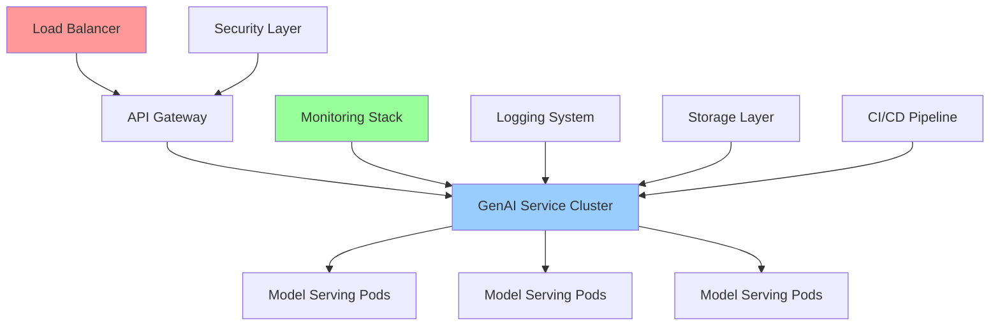
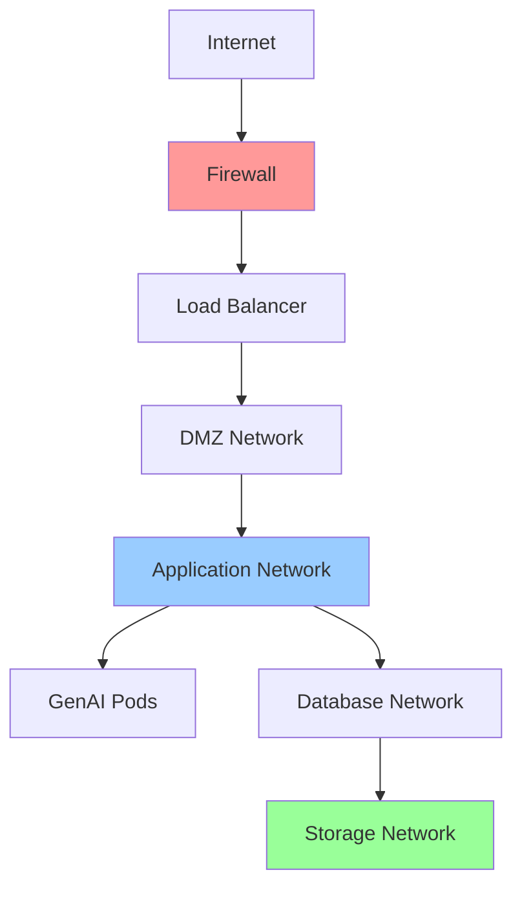
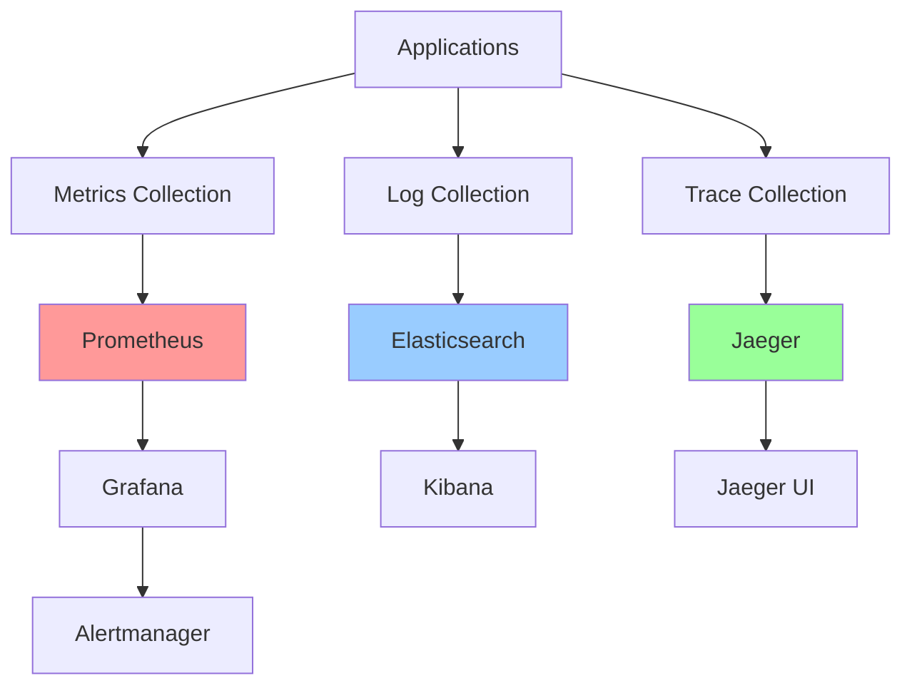
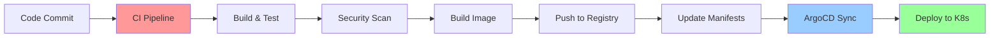
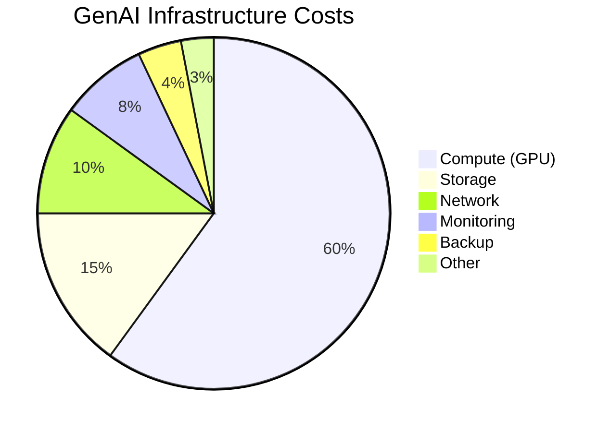

# 🏭 Production GenAI System
## PowerPoint Presentation: Deploying GenAI Onprem + Setting up Monitoring + Scaling Configuration

---

## 📋 **Slide Index**
1. [Title Slide](#slide-1-title-slide)
2. [Learning Objectives](#slide-2-learning-objectives)
3. [Production vs Development](#slide-3-production-vs-development)
4. [Architecture Overview](#slide-4-architecture-overview)
5. [On-Premise Deployment Strategy](#slide-5-on-premise-deployment-strategy)
6. [Containerization with Docker](#slide-6-containerization-with-docker)
7. [Kubernetes Orchestration](#slide-7-kubernetes-orchestration)
8. [Infrastructure Requirements](#slide-8-infrastructure-requirements)
9. [Model Serving Patterns](#slide-9-model-serving-patterns)
10. [Monitoring Fundamentals](#slide-10-monitoring-fundamentals)
11. [Metrics and KPIs](#slide-11-metrics-and-kpis)
12. [Logging and Observability](#slide-12-logging-and-observability)
13. [Scaling Strategies](#slide-13-scaling-strategies)
14. [Load Balancing](#slide-14-load-balancing)
15. [Security Considerations](#slide-15-security-considerations)
16. [CI/CD Pipeline](#slide-16-cicd-pipeline)
17. [Disaster Recovery](#slide-17-disaster-recovery)
18. [Cost Optimization](#slide-18-cost-optimization)
19. [Best Practices](#slide-19-best-practices)
20. [Q&A](#slide-20-qa)

---

## **Slide 1: Title Slide**

<div align="center">

# 🏭 **Production GenAI System**
## Deploying GenAI Onprem + Setting up Monitoring + Scaling Configuration

<br>

### 🚀 **Enterprise-Grade Deployment**
### 📊 **Comprehensive Monitoring**
### ⚖️ **Scalable Architecture**

<br>

**Presented by:** [Your Name]  
**Date:** [Current Date]  
**Duration:** 75 minutes


</div>

---

## **Slide 2: Learning Objectives**

<div align="center">

# 🎯 **Learning Objectives**

</div>

By the end of this session, you will be able to:

### 🏗️ **Deployment Mastery**
- ✅ Design production-ready GenAI architecture
- ✅ Deploy GenAI applications on-premise using containers
- ✅ Implement Kubernetes orchestration for GenAI workloads
- ✅ Configure secure and scalable infrastructure

### 📊 **Monitoring Excellence**
- ✅ Set up comprehensive monitoring systems
- ✅ Define and track critical KPIs
- ✅ Implement alerting and observability
- ✅ Create effective dashboards and reports

### ⚖️ **Scaling Expertise**
- ✅ Implement horizontal and vertical scaling
- ✅ Configure load balancing strategies
- ✅ Optimize resource utilization
- ✅ Handle variable workloads efficiently

### 🛡️ **Production Readiness**
- ✅ Apply security best practices
- ✅ Implement CI/CD pipelines
- ✅ Plan disaster recovery strategies
- ✅ Optimize costs and performance

---

## **Slide 3: Production vs Development**

<div align="center">

# 🔄 **Production vs Development**

</div>

### 📊 **Key Differences**

| **Aspect** | **Development** | **Production** |
|------------|-----------------|----------------|
| **🎯 Purpose** | Experimentation | Business Critical |
| **👥 Users** | Developers | End Users |
| **📈 Scale** | Small datasets | Enterprise scale |
| **⏱️ Uptime** | Best effort | 99.9%+ SLA |
| **🔒 Security** | Basic | Enterprise grade |
| **📊 Monitoring** | Optional | Mandatory |
| **💰 Cost** | Minimal | Optimized |
| **🔄 Updates** | Frequent | Controlled |

### ⚠️ **Production Challenges**
```
🔹 High availability requirements
🔹 Scalability under load
🔹 Security and compliance
🔹 Performance optimization
🔹 Cost management
🔹 Operational complexity
```

### 🎯 **Success Criteria**
- 🚀 **Performance:** Sub-second response times
- 🛡️ **Reliability:** 99.9% uptime
- 📈 **Scalability:** Handle 10x traffic spikes
- 🔒 **Security:** Zero data breaches
- 💰 **Cost:** Within budget constraints

---

## **Slide 4: Architecture Overview**

<div align="center">

# 🏗️ **Architecture Overview**

</div>

### 🌐 **High-Level Architecture**


### 🧩 **Core Components**

#### 🎯 **Application Layer**
```
🔹 API Gateway (Kong, Istio)
🔹 GenAI Service (FastAPI, Flask)
🔹 Model Serving (TorchServe, TensorFlow Serving)
🔹 Load Balancer (NGINX, HAProxy)
```

#### 📊 **Infrastructure Layer**
```
🔹 Container Runtime (Docker)
🔹 Orchestration (Kubernetes)
🔹 Storage (Persistent Volumes)
🔹 Networking (CNI, Service Mesh)
```

#### 🔍 **Observability Layer**
```
🔹 Metrics (Prometheus)
🔹 Logging (ELK Stack)
🔹 Tracing (Jaeger)
🔹 Dashboards (Grafana)
```

---

## **Slide 5: On-Premise Deployment Strategy**

<div align="center">

# 🏢 **On-Premise Deployment Strategy**

</div>

### 🎯 **Why On-Premise?**
```
✅ Data sovereignty and compliance
✅ Lower latency for local users
✅ Cost control for high-volume usage
✅ Custom hardware optimization
✅ Air-gapped security requirements
```

### 🏗️ **Deployment Models**

#### 🖥️ **Single Node Deployment**
```yaml
# For development/testing
Resources:
  - 1 powerful server
  - GPU acceleration
  - Local storage
  - Simple monitoring
```

#### 🏭 **Multi-Node Cluster**
```yaml
# For production workloads
Resources:
  - 3+ master nodes (HA)
  - 5+ worker nodes
  - Shared storage (NFS/Ceph)
  - Comprehensive monitoring
```

#### ☁️ **Hybrid Deployment**
```yaml
# Best of both worlds
Resources:
  - On-prem for sensitive data
  - Cloud for burst capacity
  - Edge nodes for low latency
  - Unified management
```

### 🛠️ **Infrastructure Components**
- 🖥️ **Compute:** CPU + GPU nodes
- 💾 **Storage:** High-performance SSD/NVMe
- 🌐 **Network:** High-bandwidth, low-latency
- 🔒 **Security:** Firewalls, VPN, encryption

---

## **Slide 6: Containerization with Docker**

<div align="center">

# 📦 **Containerization with Docker**

</div>

### 🐳 **Docker for GenAI**
> Containers provide consistent, portable, and scalable deployment units

### 📄 **Sample Dockerfile**
```dockerfile
# Multi-stage build for GenAI application
FROM python:3.9-slim as builder

# Install system dependencies
RUN apt-get update && apt-get install -y \
    build-essential \
    curl \
    && rm -rf /var/lib/apt/lists/*

# Install Python dependencies
COPY requirements.txt .
RUN pip install --no-cache-dir -r requirements.txt

# Production stage
FROM python:3.9-slim

# Copy installed packages
COPY --from=builder /usr/local/lib/python3.9/site-packages /usr/local/lib/python3.9/site-packages
COPY --from=builder /usr/local/bin /usr/local/bin

# Create non-root user
RUN useradd --create-home --shell /bin/bash genai
USER genai
WORKDIR /home/genai

# Copy application code
COPY --chown=genai:genai . .

# Health check
HEALTHCHECK --interval=30s --timeout=10s --start-period=60s \
  CMD curl -f http://localhost:8000/health || exit 1

# Expose port and start application
EXPOSE 8000
CMD ["python", "-m", "uvicorn", "main:app", "--host", "0.0.0.0", "--port", "8000"]
```

### 🎯 **Best Practices**
- 🔒 **Security:** Non-root user, minimal base image
- 📦 **Size:** Multi-stage builds, layer optimization
- 🏥 **Health:** Health checks and graceful shutdown
- 🔧 **Config:** Environment variables, secrets

---

## **Slide 7: Kubernetes Orchestration**

<div align="center">

# ☸️ **Kubernetes Orchestration**

</div>

### 🎯 **Why Kubernetes for GenAI?**
```
✅ Automatic scaling based on demand
✅ Self-healing and fault tolerance
✅ Rolling updates with zero downtime
✅ Resource management and optimization
✅ Service discovery and load balancing
```

### 📄 **GenAI Deployment Manifest**
```yaml
apiVersion: apps/v1
kind: Deployment
metadata:
  name: genai-service
  labels:
    app: genai-service
spec:
  replicas: 3
  selector:
    matchLabels:
      app: genai-service
  template:
    metadata:
      labels:
        app: genai-service
    spec:
      containers:
      - name: genai-app
        image: genai-service:v1.0.0
        ports:
        - containerPort: 8000
        resources:
          requests:
            memory: "2Gi"
            cpu: "1000m"
            nvidia.com/gpu: 1
          limits:
            memory: "4Gi"
            cpu: "2000m"
            nvidia.com/gpu: 1
        env:
        - name: MODEL_PATH
          value: "/models/gpt2"
        - name: MAX_BATCH_SIZE
          value: "8"
        livenessProbe:
          httpGet:
            path: /health
            port: 8000
          initialDelaySeconds: 60
          periodSeconds: 30
        readinessProbe:
          httpGet:
            path: /ready
            port: 8000
          initialDelaySeconds: 30
          periodSeconds: 10
```

### 🔧 **Key Kubernetes Resources**
- 🚀 **Deployments:** Application management
- 🌐 **Services:** Network access
- 📊 **ConfigMaps:** Configuration management
- 🔐 **Secrets:** Sensitive data
- 💾 **PersistentVolumes:** Storage

---

## **Slide 8: Infrastructure Requirements**

<div align="center">

# 🖥️ **Infrastructure Requirements**

</div>

### 🎮 **Hardware Specifications**

#### 🧠 **Compute Requirements**
| **Component** | **Minimum** | **Recommended** | **High-Performance** |
|---------------|-------------|-----------------|---------------------|
| **CPU** | 8 cores | 16 cores | 32+ cores |
| **RAM** | 32GB | 64GB | 128GB+ |
| **GPU** | 1x RTX 3080 | 2x RTX 4090 | 4x A100 |
| **Storage** | 1TB SSD | 2TB NVMe | 10TB NVMe RAID |
| **Network** | 1Gbps | 10Gbps | 25Gbps+ |

#### 📊 **Sizing Guidelines**
```
🔹 Small Models (< 1B params): 8GB GPU, 16GB RAM
🔹 Medium Models (1-7B params): 16GB GPU, 32GB RAM
🔹 Large Models (7-30B params): 40GB GPU, 64GB RAM
🔹 XL Models (30B+ params): 80GB+ GPU, 128GB+ RAM
```

### 🏗️ **Network Architecture**


### 🔒 **Security Zones**
- 🌐 **DMZ:** Public-facing services
- 🏢 **Internal:** Application services
- 💾 **Data:** Database and storage
- 🔧 **Management:** Admin and monitoring

---

## **Slide 9: Model Serving Patterns**

<div align="center">

# 🤖 **Model Serving Patterns**

</div>

### 🎯 **Serving Strategies**

#### 🔄 **Online Serving**
```python
# Real-time inference
@app.post("/generate")
async def generate_text(request: GenerateRequest):
    # Load model (cached)
    model = get_cached_model(request.model_name)
    
    # Generate response
    result = model.generate(
        prompt=request.prompt,
        max_length=request.max_length,
        temperature=request.temperature
    )
    
    return {"generated_text": result}
```

#### 📦 **Batch Serving**
```python
# Batch processing for efficiency
@app.post("/batch_generate")
async def batch_generate(requests: List[GenerateRequest]):
    # Group by model
    batches = group_by_model(requests)
    
    results = []
    for model_name, batch in batches.items():
        model = get_cached_model(model_name)
        batch_results = model.batch_generate(batch)
        results.extend(batch_results)
    
    return {"results": results}
```

### 🏗️ **Serving Architectures**

#### 🎯 **Model-per-Pod**
```
✅ Isolation and stability
✅ Independent scaling
❌ Resource overhead
❌ Cold start latency
```

#### 🔄 **Multi-Model Serving**
```
✅ Resource efficiency
✅ Shared infrastructure
❌ Resource contention
❌ Complex management
```

### 🚀 **Performance Optimization**
- 🧠 **Model Quantization:** Reduce memory usage
- ⚡ **Batching:** Improve throughput
- 💾 **Caching:** Reduce load times
- 🔄 **Connection Pooling:** Optimize networking

---

## **Slide 10: Monitoring Fundamentals**

<div align="center">

# 📊 **Monitoring Fundamentals**

</div>

### 🎯 **The Three Pillars of Observability**

#### 📈 **Metrics**
```
🔹 Quantitative measurements over time
🔹 CPU, memory, request rate, latency
🔹 Business metrics (requests/min, accuracy)
🔹 Aggregated and stored in time-series DB
```

#### 📝 **Logs**
```
🔹 Discrete events with timestamps
🔹 Application logs, error messages
🔹 Structured (JSON) or unstructured
🔹 Searchable and filterable
```

#### 🔍 **Traces**
```
🔹 Request journey through system
🔹 Distributed tracing across services
🔹 Performance bottleneck identification
🔹 End-to-end visibility
```

### 🛠️ **Monitoring Stack**


### 🚨 **Alerting Strategy**
- 🔴 **Critical:** Immediate response required
- 🟡 **Warning:** Attention needed soon
- 🔵 **Info:** Awareness notifications
- 📊 **Escalation:** Multi-tier alert routing

---

## **Slide 11: Metrics and KPIs**

<div align="center">

# 📊 **Metrics and KPIs**

</div>

### 🎯 **GenAI-Specific Metrics**

#### ⏱️ **Performance Metrics**
```yaml
Latency Metrics:
  - p50_inference_time: 200ms
  - p95_inference_time: 500ms
  - p99_inference_time: 1000ms
  - time_to_first_token: 50ms

Throughput Metrics:
  - requests_per_second: 100
  - tokens_per_second: 1000
  - concurrent_requests: 50
  - queue_depth: 10
```

#### 🎯 **Quality Metrics**
```yaml
Model Quality:
  - perplexity_score: 15.2
  - bleu_score: 0.85
  - rouge_score: 0.78
  - human_evaluation: 4.2/5

Business Metrics:
  - user_satisfaction: 4.5/5
  - task_completion_rate: 92%
  - error_rate: 0.1%
  - retry_rate: 2%
```

#### 🖥️ **Infrastructure Metrics**
```yaml
Resource Utilization:
  - cpu_utilization: 70%
  - memory_utilization: 80%
  - gpu_utilization: 85%
  - disk_io_wait: 5%

Availability:
  - uptime: 99.95%
  - error_rate: 0.05%
  - mttr: 5 minutes
  - mtbf: 30 days
```

### 📊 **Sample Grafana Dashboard**
```json
{
  "dashboard": {
    "title": "GenAI Production Metrics",
    "panels": [
      {
        "title": "Request Rate",
        "type": "graph",
        "targets": [
          {
            "expr": "rate(genai_requests_total[5m])",
            "legendFormat": "Requests/sec"
          }
        ]
      },
      {
        "title": "Inference Latency",
        "type": "graph",
        "targets": [
          {
            "expr": "histogram_quantile(0.95, genai_inference_duration_seconds_bucket)",
            "legendFormat": "95th percentile"
          }
        ]
      }
    ]
  }
}
```

---

## **Slide 12: Logging and Observability**

<div align="center">

# 📝 **Logging and Observability**

</div>

### 📊 **Structured Logging**
```python
import structlog
import json

# Configure structured logging
structlog.configure(
    processors=[
        structlog.stdlib.filter_by_level,
        structlog.stdlib.add_logger_name,
        structlog.stdlib.add_log_level,
        structlog.stdlib.PositionalArgumentsFormatter(),
        structlog.processors.TimeStamper(fmt="iso"),
        structlog.processors.StackInfoRenderer(),
        structlog.processors.format_exc_info,
        structlog.processors.JSONRenderer()
    ],
    context_class=dict,
    logger_factory=structlog.stdlib.LoggerFactory(),
    wrapper_class=structlog.stdlib.BoundLogger,
    cache_logger_on_first_use=True,
)

logger = structlog.get_logger()

# Usage in GenAI application
@app.post("/generate")
async def generate_text(request: GenerateRequest):
    request_id = str(uuid.uuid4())
    
    logger.info(
        "generation_request_started",
        request_id=request_id,
        model_name=request.model_name,
        prompt_length=len(request.prompt),
        max_length=request.max_length,
        temperature=request.temperature
    )
    
    start_time = time.time()
    
    try:
        result = await model.generate(request)
        
        logger.info(
            "generation_request_completed",
            request_id=request_id,
            duration=time.time() - start_time,
            output_length=len(result.text),
            tokens_generated=result.token_count
        )
        
        return result
        
    except Exception as e:
        logger.error(
            "generation_request_failed",
            request_id=request_id,
            duration=time.time() - start_time,
            error=str(e),
            error_type=type(e).__name__
        )
        raise
```

### 🔍 **ELK Stack Configuration**
```yaml
# Elasticsearch configuration
elasticsearch:
  cluster.name: genai-logs
  node.name: es-node-1
  network.host: 0.0.0.0
  discovery.type: single-node
  
# Logstash pipeline
input {
  beats {
    port => 5044
  }
}

filter {
  if [fields][service] == "genai" {
    json {
      source => "message"
    }
    
    mutate {
      add_field => { "service_type" => "genai" }
    }
  }
}

output {
  elasticsearch {
    hosts => ["elasticsearch:9200"]
    index => "genai-logs-%{+YYYY.MM.dd}"
  }
}
```

---

## **Slide 13: Scaling Strategies**

<div align="center">

# ⚖️ **Scaling Strategies**

</div>

### 📈 **Horizontal vs Vertical Scaling**

#### ➡️ **Horizontal Scaling (Scale Out)**
```yaml
# Kubernetes HPA configuration
apiVersion: autoscaling/v2
kind: HorizontalPodAutoscaler
metadata:
  name: genai-hpa
spec:
  scaleTargetRef:
    apiVersion: apps/v1
    kind: Deployment
    name: genai-service
  minReplicas: 3
  maxReplicas: 20
  metrics:
  - type: Resource
    resource:
      name: cpu
      target:
        type: Utilization
        averageUtilization: 70
  - type: Resource
    resource:
      name: memory
      target:
        type: Utilization
        averageUtilization: 80
  - type: Pods
    pods:
      metric:
        name: inference_queue_length
      target:
        type: AverageValue
        averageValue: "10"
```

#### ⬆️ **Vertical Scaling (Scale Up)**
```yaml
# VPA configuration
apiVersion: autoscaling.k8s.io/v1
kind: VerticalPodAutoscaler
metadata:
  name: genai-vpa
spec:
  targetRef:
    apiVersion: apps/v1
    kind: Deployment
    name: genai-service
  updatePolicy:
    updateMode: "Auto"
  resourcePolicy:
    containerPolicies:
    - containerName: genai-app
      maxAllowed:
        cpu: 4
        memory: 8Gi
      minAllowed:
        cpu: 500m
        memory: 1Gi
```

### 🎯 **Scaling Triggers**
```
📊 CPU/Memory utilization > 70%
⏱️ Average response time > 500ms
📈 Queue depth > 10 requests
🔄 Request rate increase > 50%
🎮 GPU utilization > 80%
```

### 🚀 **Advanced Scaling Patterns**
- 🔮 **Predictive Scaling:** ML-based demand forecasting
- 📅 **Scheduled Scaling:** Time-based scaling rules
- 🎯 **Custom Metrics:** Business-specific triggers
- 🌊 **Cluster Autoscaling:** Node-level scaling

---

## **Slide 14: Load Balancing**

<div align="center">

# ⚖️ **Load Balancing**

</div>

### 🎯 **Load Balancing Strategies**

#### 🔄 **Round Robin**
```nginx
upstream genai_backend {
    server genai-pod-1:8000;
    server genai-pod-2:8000;
    server genai-pod-3:8000;
}

server {
    listen 80;
    location / {
        proxy_pass http://genai_backend;
        proxy_set_header Host $host;
        proxy_set_header X-Real-IP $remote_addr;
    }
}
```

#### 🎯 **Weighted Round Robin**
```yaml
# Kubernetes Service with weights
apiVersion: v1
kind: Service
metadata:
  name: genai-service
spec:
  selector:
    app: genai
  ports:
  - port: 80
    targetPort: 8000
  sessionAffinity: None
  
# Istio traffic splitting
apiVersion: networking.istio.io/v1alpha3
kind: VirtualService
metadata:
  name: genai-vs
spec:
  http:
  - match:
    - uri:
        prefix: /
    route:
    - destination:
        host: genai-v1
      weight: 80
    - destination:
        host: genai-v2
      weight: 20
```

### 🧠 **Intelligent Load Balancing**
```python
# Custom load balancer with model awareness
class ModelAwareLoadBalancer:
    def __init__(self):
        self.model_instances = {
            'gpt2': ['pod-1', 'pod-2'],
            'bert': ['pod-3', 'pod-4'],
            'llama': ['pod-5']
        }
        self.instance_load = {}
    
    def route_request(self, request):
        model_name = request.model_name
        available_instances = self.model_instances[model_name]
        
        # Choose least loaded instance
        best_instance = min(
            available_instances,
            key=lambda x: self.instance_load.get(x, 0)
        )
        
        return best_instance
```

### 🔧 **Health Checks**
```yaml
# Kubernetes readiness probe
readinessProbe:
  httpGet:
    path: /health
    port: 8000
  initialDelaySeconds: 30
  periodSeconds: 10
  timeoutSeconds: 5
  failureThreshold: 3

# Custom health check endpoint
@app.get("/health")
async def health_check():
    try:
        # Check model availability
        model_status = check_model_health()
        # Check dependencies
        db_status = check_database()
        
        if model_status and db_status:
            return {"status": "healthy"}
        else:
            raise HTTPException(status_code=503, detail="Service unhealthy")
    except Exception as e:
        raise HTTPException(status_code=503, detail=str(e))
```

---

## **Slide 15: Security Considerations**

<div align="center">

# 🔒 **Security Considerations**

</div>

### 🛡️ **Security Layers**

#### 🌐 **Network Security**
```yaml
# Network policies
apiVersion: networking.k8s.io/v1
kind: NetworkPolicy
metadata:
  name: genai-network-policy
spec:
  podSelector:
    matchLabels:
      app: genai-service
  policyTypes:
  - Ingress
  - Egress
  ingress:
  - from:
    - podSelector:
        matchLabels:
          app: api-gateway
    ports:
    - protocol: TCP
      port: 8000
  egress:
  - to:
    - podSelector:
        matchLabels:
          app: database
    ports:
    - protocol: TCP
      port: 5432
```

#### 🔐 **Secrets Management**
```yaml
# Kubernetes Secret
apiVersion: v1
kind: Secret
metadata:
  name: genai-secrets
type: Opaque
data:
  api-key: <base64-encoded-key>
  model-token: <base64-encoded-token>
  
---
# Using secrets in deployment
apiVersion: apps/v1
kind: Deployment
metadata:
  name: genai-service
spec:
  template:
    spec:
      containers:
      - name: genai-app
        env:
        - name: API_KEY
          valueFrom:
            secretKeyRef:
              name: genai-secrets
              key: api-key
        - name: MODEL_TOKEN
          valueFrom:
            secretKeyRef:
              name: genai-secrets
              key: model-token
```

### 🔒 **Authentication & Authorization**
```python
# JWT-based authentication
from fastapi import Depends, HTTPException, status
from fastapi.security import HTTPBearer
import jwt

security = HTTPBearer()

def verify_token(token: str = Depends(security)):
    try:
        payload = jwt.decode(token.credentials, SECRET_KEY, algorithms=["HS256"])
        username = payload.get("sub")
        if username is None:
            raise HTTPException(
                status_code=status.HTTP_401_UNAUTHORIZED,
                detail="Invalid authentication credentials"
            )
        return username
    except jwt.PyJWTError:
        raise HTTPException(
            status_code=status.HTTP_401_UNAUTHORIZED,
            detail="Invalid authentication credentials"
        )

@app.post("/generate")
async def generate_text(
    request: GenerateRequest,
    current_user: str = Depends(verify_token)
):
    # Rate limiting per user
    if not check_rate_limit(current_user):
        raise HTTPException(
            status_code=status.HTTP_429_TOO_MANY_REQUESTS,
            detail="Rate limit exceeded"
        )
    
    return await process_generation(request)
```

### 🛡️ **Security Best Practices**
- 🔒 **Encryption:** TLS in transit, encryption at rest
- 🎯 **Least Privilege:** Minimal permissions
- 🔍 **Audit Logging:** Track all access
- 🚫 **Input Validation:** Sanitize all inputs
- 🔄 **Regular Updates:** Security patches

---

## **Slide 16: CI/CD Pipeline**

<div align="center">

# 🔄 **CI/CD Pipeline**

</div>

### 🚀 **GitOps Workflow**


### 📄 **GitHub Actions Pipeline**
```yaml
name: GenAI CI/CD Pipeline

on:
  push:
    branches: [main]
  pull_request:
    branches: [main]

jobs:
  test:
    runs-on: ubuntu-latest
    steps:
    - uses: actions/checkout@v3
    
    - name: Set up Python
      uses: actions/setup-python@v4
      with:
        python-version: '3.9'
    
    - name: Install dependencies
      run: |
        pip install -r requirements.txt
        pip install pytest pytest-cov
    
    - name: Run tests
      run: |
        pytest tests/ --cov=src/ --cov-report=xml
    
    - name: Security scan
      uses: securecodewarrior/github-action-add-sarif@v1
      with:
        sarif-file: security-scan-results.sarif

  build:
    needs: test
    runs-on: ubuntu-latest
    steps:
    - uses: actions/checkout@v3
    
    - name: Build Docker image
      run: |
        docker build -t genai-service:${{ github.sha }} .
    
    - name: Push to registry
      run: |
        echo ${{ secrets.DOCKER_PASSWORD }} | docker login -u ${{ secrets.DOCKER_USERNAME }} --password-stdin
        docker push genai-service:${{ github.sha }}

  deploy:
    needs: build
    runs-on: ubuntu-latest
    if: github.ref == 'refs/heads/main'
    steps:
    - name: Deploy to staging
      run: |
        kubectl set image deployment/genai-service genai-app=genai-service:${{ github.sha }} -n staging
    
    - name: Run integration tests
      run: |
        ./scripts/integration-tests.sh staging
    
    - name: Deploy to production
      run: |
        kubectl set image deployment/genai-service genai-app=genai-service:${{ github.sha }} -n production
```

### 🎯 **Deployment Strategies**
- 🔵 **Blue-Green:** Zero downtime deployments
- 🌊 **Rolling Updates:** Gradual rollout
- 🕯️ **Canary:** Risk-free testing
- 🔄 **A/B Testing:** Performance comparison

---

## **Slide 17: Disaster Recovery**

<div align="center">

# 🚨 **Disaster Recovery**

</div>

### 🎯 **DR Strategy Components**

#### 💾 **Backup Strategy**
```yaml
# Automated backup configuration
apiVersion: batch/v1
kind: CronJob
metadata:
  name: model-backup
spec:
  schedule: "0 2 * * *"  # Daily at 2 AM
  jobTemplate:
    spec:
      template:
        spec:
          containers:
          - name: backup
            image: backup-tool:latest
            command:
            - /bin/sh
            - -c
            - |
              # Backup models
              aws s3 sync /models s3://genai-backups/models/$(date +%Y%m%d)
              
              # Backup configurations
              kubectl get configmaps -o yaml > /tmp/configmaps.yaml
              aws s3 cp /tmp/configmaps.yaml s3://genai-backups/configs/
              
              # Backup secrets (encrypted)
              kubectl get secrets -o yaml | gpg --encrypt > /tmp/secrets.yaml.gpg
              aws s3 cp /tmp/secrets.yaml.gpg s3://genai-backups/secrets/
          restartPolicy: OnFailure
```

#### 🔄 **Multi-Region Setup**
```yaml
# Primary region (us-east-1)
primary_cluster:
  region: us-east-1
  nodes: 5
  replicas: 3
  
# DR region (us-west-2)
dr_cluster:
  region: us-west-2
  nodes: 3
  replicas: 2
  sync_frequency: "5m"
```

### 📊 **RTO/RPO Targets**
```
🎯 Recovery Time Objective (RTO): 15 minutes
📊 Recovery Point Objective (RPO): 5 minutes
🔄 Backup Frequency: Every 4 hours
🌐 Cross-region replication: Real-time
```

### 🚨 **Incident Response Plan**
```
1. 🔍 Detection: Automated monitoring alerts
2. 📞 Notification: On-call engineer paged
3. 🔧 Assessment: Determine impact and cause
4. 🚀 Response: Execute recovery procedures
5. 📊 Recovery: Restore service functionality
6. 📝 Post-mortem: Document lessons learned
```

---

## **Slide 18: Cost Optimization**

<div align="center">

# 💰 **Cost Optimization**

</div>

### 📊 **Cost Breakdown**


### 💡 **Optimization Strategies**

#### 🎮 **GPU Optimization**
```python
# Dynamic GPU allocation
class GPUResourceManager:
    def __init__(self):
        self.gpu_pool = GPUPool()
        self.request_queue = Queue()
    
    async def allocate_gpu(self, request):
        # Check if GPU is needed
        if request.model_size < SMALL_MODEL_THRESHOLD:
            return await self.cpu_inference(request)
        
        # Use GPU pool
        gpu = await self.gpu_pool.acquire()
        try:
            result = await self.gpu_inference(request, gpu)
            return result
        finally:
            await self.gpu_pool.release(gpu)
    
    async def batch_requests(self):
        # Batch multiple requests for efficiency
        batch = []
        while len(batch) < MAX_BATCH_SIZE:
            try:
                request = await asyncio.wait_for(
                    self.request_queue.get(), timeout=0.1
                )
                batch.append(request)
            except asyncio.TimeoutError:
                break
        
        if batch:
            return await self.process_batch(batch)
```

#### ⏰ **Scheduled Scaling**
```yaml
# Scale down during off-hours
apiVersion: autoscaling/v2
kind: HorizontalPodAutoscaler
metadata:
  name: genai-scheduled-hpa
spec:
  scaleTargetRef:
    apiVersion: apps/v1
    kind: Deployment
    name: genai-service
  minReplicas: 1  # Off-hours minimum
  maxReplicas: 10
  behavior:
    scaleDown:
      stabilizationWindowSeconds: 300
      policies:
      - type: Percent
        value: 50
        periodSeconds: 60
    scaleUp:
      stabilizationWindowSeconds: 60
      policies:
      - type: Percent
        value: 100
        periodSeconds: 60
```

### 📈 **Cost Monitoring**
```python
# Cost tracking middleware
@app.middleware("http")
async def cost_tracking_middleware(request: Request, call_next):
    start_time = time.time()
    
    # Track resource usage
    initial_gpu_memory = get_gpu_memory_usage()
    initial_cpu = get_cpu_usage()
    
    response = await call_next(request)
    
    # Calculate costs
    duration = time.time() - start_time
    gpu_memory_used = get_gpu_memory_usage() - initial_gpu_memory
    cpu_used = get_cpu_usage() - initial_cpu
    
    # Log cost metrics
    cost_logger.info({
        "request_id": request.headers.get("x-request-id"),
        "duration": duration,
        "gpu_memory_mb": gpu_memory_used,
        "cpu_seconds": cpu_used * duration,
        "estimated_cost": calculate_cost(duration, gpu_memory_used, cpu_used)
    })
    
    return response
```

### 💰 **Cost Optimization Tips**
- 🎯 **Right-sizing:** Match resources to workload
- ⏰ **Scheduling:** Scale down during off-hours
- 📦 **Spot Instances:** Use for non-critical workloads
- 🗜️ **Model Optimization:** Quantization, pruning
- 💾 **Storage Tiering:** Hot/warm/cold data strategy

---

## **Slide 19: Best Practices**

<div align="center">

# 🌟 **Best Practices**

</div>

### 🏗️ **Architecture Best Practices**
```
✅ Microservices architecture for modularity
✅ Stateless services for scalability
✅ Circuit breakers for fault tolerance
✅ Async processing for performance
✅ Caching layers for efficiency
```

### 🔧 **Operational Best Practices**
```
✅ Infrastructure as Code (IaC)
✅ GitOps for deployment management
✅ Comprehensive monitoring and alerting
✅ Regular security audits
✅ Automated testing and validation
```

### 📊 **Performance Best Practices**
```python
# Connection pooling
from sqlalchemy.pool import QueuePool

engine = create_engine(
    DATABASE_URL,
    poolclass=QueuePool,
    pool_size=20,
    max_overflow=30,
    pool_pre_ping=True
)

# Async processing
import asyncio
from concurrent.futures import ThreadPoolExecutor

class AsyncModelService:
    def __init__(self):
        self.executor = ThreadPoolExecutor(max_workers=4)
        self.model_cache = {}
    
    async def generate_async(self, request):
        loop = asyncio.get_event_loop()
        
        # Run CPU-intensive task in thread pool
        result = await loop.run_in_executor(
            self.executor,
            self.generate_sync,
            request
        )
        
        return result
    
    def generate_sync(self, request):
        model = self.get_cached_model(request.model_name)
        return model.generate(request.prompt)
```

### 🔒 **Security Best Practices**
```
✅ Principle of least privilege
✅ Regular security updates
✅ Input validation and sanitization
✅ Audit logging for compliance
✅ Secrets management with rotation
```

### 💰 **Cost Best Practices**
```
✅ Resource monitoring and optimization
✅ Automated scaling policies
✅ Reserved instances for predictable workloads
✅ Regular cost reviews and optimization
✅ Multi-cloud strategy for cost arbitrage
```

### 📈 **Monitoring Best Practices**
```
✅ SLI/SLO definition and tracking
✅ Proactive alerting with runbooks
✅ Distributed tracing for debugging
✅ Regular dashboard reviews
✅ Incident response procedures
```

---

## **Slide 20: Q&A**

<div align="center">

# ❓ **Questions & Discussion**

<br>

## 🤔 **Common Questions**

### **Q: How do we handle model updates in production without downtime?**
**A:** Use blue-green deployments or canary releases. Deploy new model version alongside current one, gradually shift traffic, then retire old version.

### **Q: What's the best way to handle GPU resource contention?**
**A:** Implement GPU sharing with tools like NVIDIA MPS, use queue-based scheduling, and consider multi-instance GPU (MIG) for newer cards.

### **Q: How do we ensure data privacy in on-premise deployments?**
**A:** Implement end-to-end encryption, use network segmentation, audit all data access, and ensure compliance with regulations like GDPR.

### **Q: What's the recommended approach for disaster recovery testing?**
**A:** Regular DR drills (monthly), automated failover testing, chaos engineering practices, and documented recovery procedures.

<br>

## 💬 **Discussion Topics**
### Share your experiences with:
- 🏭 Production deployment challenges
- 📊 Monitoring and alerting strategies
- 💰 Cost optimization techniques
- 🔒 Security implementation approaches

<br>

## 📚 **Additional Resources**
**Documentation:** [Kubernetes, Prometheus, Grafana docs]  
**Tools:** [Helm charts, monitoring templates]  
**Community:** [CNCF, Kubernetes slack channels]

</div>

---

<div align="center">

# 🎉 **Congratulations!**

**You're now ready to deploy production GenAI systems! 🚀**


**Build reliable, scalable, and secure GenAI solutions! 💪**

</div>